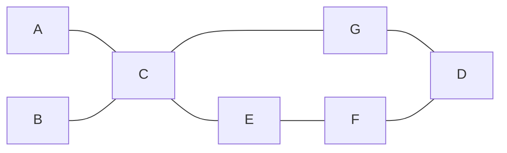
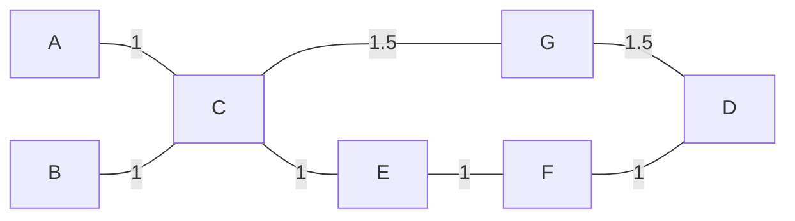

### [[Intro#2. Qual è il protocollo alla base del core di Internet? Qual è il suo limite maggiore e come lo si può risolvere?|1. Cosa si intente per scalabilità di una rete?]]

### [[Intro#3. Come si raggiunge flessibilità nelle reti? Qual è la differenza con la scalabilità?|2. Cosa si intende per flessibilità di una rete?]]

### 3. Cosa si intende per network performance?

Le performance di una rete possono essere ottimizzate attraverso il **traffic engineering**, un approccio che non si limita a far arrivare i pacchetti a destinazione, ma si preoccupa di farlo in modo efficiente per tutta la rete. L'obiettivo del traffic engineering è migliorare l'utilizzo delle risorse di rete, ridurre la congestione e bilanciare il carico tra vari percorsi disponibili.

Quando si inviano pacchetti tra due **edge routers**, spesso esistono più path disponibili attraverso la rete. I protocolli tradizionali di **IP routing** (come OSPF o BGP) scelgono generalmente un solo percorso ottimale basato su metriche come il numero di salti (hop count) o la capacità di trasmissione attuale di quel singolo percorso.
Il routing tradizionale tuttavia non sfrutta appieno tutti i possibili **path** che collegano i due router. Questo approccio può portare a un utilizzo inefficiente della rete: alcuni percorsi potrebbero essere congestionati, mentre altri rimangono sottoutilizzati. In questo scenario, la rete non è utilizzata al massimo della sua capacità.

Il **traffic engineering** mira a risolvere questo problema sfruttando tutti i percorsi disponibili tra due punti della rete, distribuendo i pacchetti su diversi percorsi attraverso il **load balancing**. Questo significa che invece di instradare tutto il traffico su un solo percorso, il traffico viene distribuito tra più percorsi, migliorando l'efficienza complessiva e riducendo il rischio di congestionare una singola path.

In pratica, il traffic engineering cerca di:
- **Bilanciare il carico**: distribuire il traffico su più percorsi per evitare il sovraccarico di uno solo.
- **Aumentare la resilienza**: distribuendo il traffico, la rete è meno vulnerabile a guasti su un singolo percorso.

### 4. Come funziona il Label Switching?

Il **label switching** si basa su due azioni fondamentali:
1. **Classificazione (Forwarding Equivalent Classes - FEC)**: In questa fase, i pacchetti vengono suddivisi in **Forwarding Equivalent Classes (FEC)**, cioè *insiemi di pacchetti* che verranno trattati in modo identico durante il loro instradamento. Il set di destinazioni possibili è finito ma ampio, quindi, attraverso una funzione, i pacchetti vengono raggruppati in classi equivalenti. Ad esempio, pacchetti con lo stesso prefisso IP, la stessa destinazione o che richiedono un certo livello di servizio possono appartenere alla stessa FEC. Pacchetti appartenenti alla stessa FEC vengono considerati "uguali" per il processo di forwarding.
2. **Mapping (Associazione FEC-Path)**: Dopo aver suddiviso i pacchetti in classi (FEC), si effettua il mapping tra queste *classi* e il *path* che i pacchetti di quella classe seguiranno attraverso la rete. Inoltre, è possibile che più classi condividano lo stesso percorso, poiché il trattamento che devono ricevere è identico.

![[Label Switching.png|center|600]]

#### Protocollo IP

Il protocollo IP può implementare il modello di **label switching** basandosi *sull'indirizzo di destinazione* del pacchetto, utilizzando tecniche che coinvolgono la **routing table** di ciascun router. Ecco come funziona il processo.

La **Forwarding Equivalent Class (FEC)** può essere vista come l'insieme delle **entries** presenti nella **routing table**. In altre parole, ogni entry della tabella di routing rappresenta una possibile classe di forwarding per un pacchetto con una determinata destinazione. Formalmente, possiamo esprimere questa relazione come:
$$\{FEC_{i} = \text{le entries della routing table}\}$$

Una caratteristica fondamentale del protocollo IP è che *tutti i router nella rete condividono lo stesso insieme di entries*, cioè hanno una visione coerente delle destinazioni di rete, il che garantisce la consistenza delle FEC tra tutti i router.

| prefix     | next hop |
| ---------- | -------- |
| a.b.c.d/24 | C        |

- **$f_{1}$ Longest Prefix Match (LPM)**: Quando un pacchetto arriva a un router, il router esamina la destinazione del pacchetto e cerca il prefisso più lungo nella sua routing table che corrisponde all'indirizzo di destinazione. Questa operazione permette di selezionare la entry di routing più specifica.
- **$f_{2}$: OSPF**: Garantisce che tutti i router abbiano una visione completa e aggiornata della topologia di rete. Questo significa che tutti i router possono *autonomamente* calcolare il percorso più breve verso una destinazione utilizzando l'algoritmo di **Dijkstra**. Inoltre, anche se ci sono diversi next hop corrispondenti allo stesso indirizzo di destinazione, tutti i router calcolano la stessa shortest path grazie alla consistenza della topologia.

Questo approccio, in cui ogni router, sia **edge** che **core**, esegue le operazioni di **LPM** e **OSPF** per ogni pacchetto, rappresenta una soluzione completamente distribuita. Un tempo, l'idea era che questa modalità distribuita fosse la migliore opzione.
Tuttavia, con il tempo, è diventato chiaro che questo approccio **non è scalabile né efficiente** in reti di grandi dimensioni. Il motivo è che richiede che ogni router, indipendentemente dalla sua posizione nella rete, debba eseguire tutte le operazioni di routing in modo indipendente per ogni pacchetto, il che aumenta significativamente la complessità e i tempi di calcolo. Questo è uno dei motivi per cui modelli più centralizzati e ottimizzati, come **MPLS (Multiprotocol Label Switching)**, sono diventati più popolari per ottimizzare il routing e gestire meglio il traffico.

#### MPLS

Con **MPLS (Multiprotocol Label Switching)**, vogliamo basarci sullo stesso modello di instradamento ma in modo più efficiente e scalabile rispetto a IProuting. La differenza chiave sta nel fatto che, in MPLS, gran parte delle decisioni di instradamento e classificazione dei pacchetti viene spostata agli **edge routers**, mentre i **core routers** si limitano a inoltrare i pacchetti basandosi su etichette già assegnate.

- **$f_{1}$ Classificazione**: Avviene tramite una *policy* configurata solo negli edge routers. Questa policy determina quante e quali classi di pacchetti verranno generate. A differenza del routing IP tradizionale, in cui la classificazione è fissa e basata esclusivamente sugli indirizzi di destinazione, MPLS permette una maggiore flessibilità, poiché la policy può essere configurata in modo più ampio. La classificazione può, ad esempio, basarsi non solo sulla destinazione IP, ma anche su parametri come il tipo di servizio o altre caratteristiche del traffico.
- **$f_{2}$: Mapping e Labeling**: Anche il processo di mapping avviene solo sugli edge routers. Gli edge routers calcolano il percorso del pacchetto (come farebbe un router IP usando OSPF o altri algoritmi), e aggiungono un'etichetta al pacchetto. Questa label rappresenta la classe del pacchetto e il percorso che dovrà seguire attraverso la rete. In questo modo i **core routers** non devono ricalcolare la classificazione o il percorso; si limitano a leggere la label associata al pacchetto e a consultare una tabella di forwarding basata sulle label.

Quindi per ogni core router avremo una tabella fatta in questo modo: 

| label | next hop |
| ----- | -------- |
| Lj    | C        |

E vediamo che il numero di entries della tabella sarà pari al numero di path e non al numero di prefissi. In questo modo garantiamo: 
1. Flessibilità: Garantita da $f_{1}$ infatti gli edge routers possono utilizzare politiche specifiche per assegnare le classi in base a una varietà di criteri, come QoS, tipi di traffico o criteri di sicurezza.
2. Scalabilità: I core routers non devono più scalare in base al numero di **prefissi IP**, che può essere estremamente grande in reti complesse. Invece, devono solo scalare in base al numero di **path**, che è significativamente inferiore rispetto ai prefissi IP. Questo riduce la complessità della tabella di forwarding nei core routers e rende la rete molto più scalabile.

Esempi di regole che possono essere applicate sono: 

| Regola                                 | Classe | Label |
| -------------------------------------- | ------ | ----- |
| prefisso 10.1.0.0/16 && DSCP=101110    | FEC1   | 14    |
| prefisso 10.1.0.0/16 \|\| 10.1.0.0/16  | FEC2   | 16    |
| prefisso 10.1.0.0/16 && TCP Protocol   | FEC3   | 23    |
| prefisso 10.1.0.0/16 && INport=Se0/0/0 | FEC4   | 15    |

#### Source Routing

Nel **source routing**, si utilizza il **Routing Header** per indicare al pacchetto quali router specifici deve attraversare. Tuttavia, codificare l'intero percorso in questo modo non è efficiente perché ogni volta che il pacchetto arriva a un router, il Routing Header deve essere aggiornato per indicare il prossimo router, il che richiede una modifica del pacchetto aggiungendo overhead e rallentando l'instradamento.

Al contrario, la versione basata su **label switching** (come in **MPLS**) è molto più efficiente in quanto può essere realizzata in hardware. 

### 5. Quali sono i possibili scope di MPLS?

Se una **label** è valida per tutta la rete, si dice che è **domain-wide**. Questo significa che tutti i router all'interno della rete utilizzano la stessa label per le stesse **FEC**. Tuttavia, questa soluzione presenta alcuni svantaggi:
- **Scalabilità limitata** nel **data plane**, poiché ogni label deve essere coordinata e mantenuta in modo consistente tra tutti i router della rete.
- È necessario garantire la **consistenza delle label** tra tutti i router, il che può essere complesso e oneroso.
In questo caso, **non c'è label switching** lungo il percorso: una volta assegnata una label a una FEC, questa label rimane invariata per l'intero percorso del pacchetto, riducendo la flessibilità del sistema.

Nell'approccio **local-scope**, invece, le label vengono cambiate a ogni router. Questo ha diversi vantaggi:
- Ogni router può assegnare e gestire le proprie label senza dover coordinarsi con gli altri router per mantenere la consistenza. Ciò riduce la necessità di accordi tra i router e permette una gestione più autonoma.
- **Migliore scalabilità**: Poiché le label sono locali a ciascun router, non è necessario garantire la coerenza delle label in tutta la rete, semplificando la gestione e migliorando la scalabilità.

In questo approccio, ogni router mantiene una tabella che associa la **label in ingresso** a una **label in uscita** e al **next hop**. Questo processo introduce il vero **label switching**, poiché ogni router sostituisce la label in ingresso con una nuova label prima di inoltrare il pacchetto al router successivo. In questo modo, la rete può scalare più facilmente e gestire il traffico in modo più efficiente, con ogni router che opera in modo indipendente.

### 6. Come funziona il data plane di MPLS?

Il **data plane** di **MPLS (Multiprotocol Label Switching)** è caratterizzato dall'uso di uno **stack di label** e da una serie di operazioni che possono essere effettuate su di esso:
- **Push**: Inserisce una nuova label sopra lo stack di label esistente. Questa operazione viene usata quando il pacchetto attraversa una sottorete MPLS.
- **Swap**: Sostituisce la label in cima allo stack con una nuova label. La nuova label dipende dalla tabella di forwarding MPLS del router, che associa le label in ingresso con quelle in uscita.
- **Pop**: Rimuove la label in cima allo stack. L'operazione di pop può essere eseguita o quando il pacchetto raggiunge il penultimo router prima della destinazione o all'ultimo router, eliminando l'header MPLS e permettendo al pacchetto di essere trattato come un normale pacchetto IP.

Le **label MPLS** sono inserite tra il **layer 2** e il **layer 3**, ovvero tra l'header del livello data link (ad esempio Ethernet o PPP) e l'header del protocollo di rete (ad esempio IP). Questo è il motivo per cui nel data plane MPLS non si aggiornano più gli header IP, ma solo l'**header MPLS**.

### 7. Da quali campi è composto l'header MPLS?

L'header MPLS è composto dai seguenti campi:
- **Label**: È il campo principale, di dimensione fissa pari a **20 bit**, utilizzato per identificare la FEC, cioè il gruppo di pacchetti che condividono lo stesso percorso e trattamento di forwarding.
- **Traffic Class (TC)**: Un campo di **3 bit** usato per la gestione della **qualità del servizio (QoS)** e per la priorità del traffico. Questo campo può essere utilizzato per classificare i pacchetti e fornire un trattamento differenziato in base alla loro classe di traffico.
- **TTL (Time to Live)**: Un campo di **8 bit** simile al TTL nel protocollo IP, utilizzato per limitare il numero di hop che un pacchetto può attraversare nella rete MPLS. Infatti, ad ogni hop lungo il percorso, non viene aggiornato l'header IP, ma solo l'**header MPLS** quindi è necessario un campo **TTL** anche in questo header per garantire che il pacchetto non circoli indefinitamente nella rete.
- **S (Bottom of Stack)**: Un campo di **1 bit** che indica se la label corrente è l'ultima nello stack di label. Se il bit **S** è impostato a 1, significa che quella label è in fondo allo stack e che il pacchetto MPLS non ha altre label da elaborare.

![[MPLS header.png|center|600]]

### 8. Quali operazioni vengono svolte quando un pacchetto arriva ad un router in MPLS?

Se un **router MPLS** riceve un pacchetto **senza label** (probabilmente proveniente dall'esterno della rete MPLS), segue il seguente processo:
1. **Classificazione**: Il router esamina la **tabella di classificazione** per determinare a quale **Forwarding Equivalent Class (FEC)** appartiene il pacchetto.
2. **PUSH**: Una volta determinata la FEC, il router controlla la **Next Hop Label Forwarding Entry (NHLFE)**. L'operazione di **PUSH** viene eseguita per inserire la **label** MPLS nello stack del pacchetto. Il pacchetto, ora etichettato, viene inoltrato al **next hop**.

Se invece il router riceve un **pacchetto con una label** già presente, il processo è diverso:
1. **Incoming Label Map (ILM)**: Il router consulta la **Incoming Label Map (ILM)**, che associa ogni label in ingresso a un puntatore verso la **Next Hop Label Forwarding Entry (NHLFE)**. Questo contiene le istruzioni su come gestire il pacchetto, basate sulla label ricevuta.
2. **SWAP**: Se la NHLFE specifica un'operazione di **SWAP**, la label in cima allo stack viene sostituita con una nuova label, che rappresenta il percorso successivo. Il pacchetto viene quindi inoltrato al **next hop** con la nuova label.

Infine, se il pacchetto con una label arriva al router e la **Next Hop Label Forwarding Entry (NHLFE)** indica un'operazione di **POP**:
1. **POP**: La label in cima allo stack viene rimossa. Se il pacchetto non ha altre label nello stack dopo la rimozione, il pacchetto torna a essere un normale pacchetto IP.
2. **Routing IP**: Il pacchetto senza label viene passato al **piano di routing IP** del router, che esegue un'operazione di instradamento tradizionale per determinare la destinazione finale. In questo caso, il pacchetto viene processato due volte: una volta per la rimozione della label e un'altra per il routing IP.

### 9. In cosa consiste il Penultimate Hop Popping?

Come accennato, se un pacchetto MPLS giunge all'**ultimo router** della rete MPLS, questo router dovrà eseguire due processi: prima rimuovere l'ultima **label** con una POP e poi instradare il pacchetto utilizzando il tradizionale **IP routing**. Questo comporta una doppia elaborazione.

Esiste un metodo più efficiente per gestire questa situazione, noto come **Penultimate Hop Popping (PHP)**. Con PHP, l'operazione di POP viene eseguita dal **penultimo router** lungo il percorso, anziché dall'ultimo router. In altre parole, il penultimo router rimuove la label MPLS dal pacchetto e lo inoltra al router finale **senza label**, pronto per essere processato come un normale pacchetto IP.

In questo modo il pacchetto arriva all'ultimo router già privo della label MPLS, quindi non deve essere processato due volte (prima per rimuovere la label e poi per il routing IP). Inoltre, si ha una riduzione del carico sugli edge routers.

Il penultimo router deve però essere "consapevole" di essere il penultimo nodo prima dell'edge router finale. 

### 10. In cosa consiste il Label Stacking?

Il **label stacking** è una delle caratteristiche distintive di **MPLS**, ed è ciò che ha contribuito a renderlo famoso. Anche se MPLS fu originariamente progettato per migliorare la **scalabilità** delle reti, è stato adottato principalmente per la **flessibilità** che offre grazie al label stacking.

Il **label stacking** permette di inserire più di una **label** tra il **layer 2** e il **layer 3**, organizzandole come una pila. Ogni label nello stack rappresenta una parte differente del percorso che il pacchetto deve attraversare, e i router possono manipolare lo stack per instradare i pacchetti in modo dinamico.
Un **pacchetto senza label** o con una sola label ha il **bit S**  impostato a **1**, indicando che la label corrente è l'ultima o l'unica nello stack.

Le operazioni sullo stack sono le stesse ma vengono applicate alla label in cima alla pila. Inoltre, è consentito **processare il pacchetto più volte** senza dover riscrivere l'header IP. Un'operazione comune è la combinazione di **swap + push**, dove il router sostituisce la label in cima alla pila e ne aggiunge una nuova, creando così uno stack più profondo.

#### Esempio:

Supponiamo che un pacchetto attraversi una rete MPLS in cui sono presenti **due livelli di routing**: una rete principale (backbone) e una rete locale.
1. **Prima fase (ingresso nella rete)**: Un pacchetto IP entra nella rete MPLS attraverso un edge router, che esegue un'operazione di **push** per aggiungere una label che instraderà il pacchetto attraverso la rete principale (backbone).
2. **Seconda fase (instradamento nel backbone)**: Il pacchetto viaggia attraverso i router del backbone, che eseguono operazioni di **swap** sulle label per instradare il pacchetto lungo il percorso. A un certo punto, il pacchetto può raggiungere un router che esegue una combinazione di **swap + push**, aggiungendo una seconda label per il routing nella rete locale.
3. **Terza fase (uscita dal backbone e instradamento locale)**: Quando il pacchetto raggiunge il penultimo router del backbone, viene eseguito un **pop** della prima label (utilizzando il Penultimate Hop Popping), lasciando solo la seconda label nello stack, che verrà usata per instradare il pacchetto all'interno della rete locale.
4. **Quarta fase (routing locale)**: Il pacchetto ora viene inoltrato all'interno della rete locale utilizzando la label rimanente, fino a raggiungere la destinazione finale.

Il vantaggio del **label stacking** è che consente di creare **tunnel** all'interno della rete, simili a sottoreti, facilitando il **fast rerouting** in caso di guasto di un nodo, permettendo al traffico di essere rapidamente reindirizzato su un altro percorso senza interruzioni significative.
La prima label inserita è chiamata **transport label** mentre le altre **service label**.

### 11. Quali funzioni implementa il control plane di MPLS?

Nel **control plane** di MPLS, i router devono eseguire diverse funzioni:
1. **Creare collegamenti tra FEC e label**: Si definisce come i pacchetti appartenenti a una certa FEC saranno etichettati.
2. **Informare gli altri router**: Dopo aver creato i collegamenti FEC-label, il router deve informare gli altri router nella rete di queste associazioni, in modo che tutti possano instradare i pacchetti correttamente.
3. **Costruire e mantenere la tabella di forwarding**: I router combinano le informazioni ricevute dagli altri router per costruire e mantenere la tabella di forwarding, che sarà utilizzata dal **label switching component** per instradare i pacchetti in modo efficiente.

I modi per assegnare la label sono:
- **Per-interface scope**: La label assegnata dipende dall'interfaccia attraverso cui il pacchetto viene ricevuto. Ogni interfaccia può avere un'associazione diversa tra FEC e label.
- **Per-LSR (Label Switching Router) scope**: La label è valida all'interno di un singolo router, indipendentemente dall'interfaccia attraverso cui il pacchetto è ricevuto. Questo significa che la stessa label può essere usata su più interfacce dello stesso router per la stessa FEC.

Per quanto riguarda invece la distribuzione delle informazioni, abbiamo:
- **Downstream-assignment**: il router downstream assegna autonomamente una label per una determinata FEC e la invia al router upstream.
- **Downstream-on-demand**: il router upstream, che vuole sapere la label per una determinata FEC, la richiede esplicitamente al router downstream.
- **Unsolicited downstream**: un router downstream è abilitato a distribuire le associazioni di label che ha creato a tutti gli altri router, senza che ci sia stata una richiesta esplicita.

Le possibili **retention modes** nel contesto dell'assegnazione delle label sono:
- **Liberal**: Il router mantiene tutte le associazioni di label che riceve, anche se non le utilizza immediatamente. Se ha due alternative di label, sceglie quella che ritiene migliore e tiene l'altra come backup per un possibile utilizzo futuro, senza scartarla.
- **Conservative**: In questa modalità, il router salva solo l'associazione di label necessaria per il percorso corrente. Non mantiene associazioni inutilizzate, riducendo la complessità della tabella. Se un'alternativa non è necessaria, viene scartata, mantenendo solo una label primaria e le altre solo come backup se richiesto.

### 12. Come avviene il setup del control plane dei router?

Una possibile soluzione è utilizzare la **user-defined configuration**, dove le configurazioni sono definite *manualmente* dall'amministratore di rete, ad esempio basandosi sugli indirizzi di destinazione o su altre informazioni specifiche, e impostandole su ogni router individualmente.

Un'altra opzione è *automatizzare* il processo. In questo caso, le partizioni di rete potrebbero essere preconfigurate dai fornitori e adottate di default da tutti i router. 
Un primo passo in questa direzione è assegnare un **indirizzo /30** a ogni collegamento. I router collegati tramite quel link avranno un indirizzo all'interno di quella sottorete. Ad esempio, se il link ha l'indirizzo **172.16.0.4/30**, i due router collegati a quel link avranno rispettivamente gli indirizzi **172.16.0.5/30** e **172.16.0.6/30**, garantendo una configurazione coerente e automatica per i collegamenti tra i router. Tali indirizzi saranno privati in quanto non siamo interessati a collegarli alla rete Internet. 

Nella tabella di routing, ad esempio di R1, abbiamo elencato tutti gli indirizzi **interni** del sistema che abbiamo creato, come mostrato nell'esempio seguente:

| PREFIX        | NEXT HOP |
| ------------- | -------- |
| 172.16.0.0/30 | R3       |
| 172.16.0.4/30 | R2       |
| ...           | ...      |
Ad esempio, la prima entry indica che tutto il traffico destinato alla sottorete **172.16.0.0/30** deve essere inoltrato al router **R3**.

Ora è necessario gestire gli **indirizzi esterni**, cioè gli indirizzi delle reti al di fuori del network locale. La tabella di routing aggiornata includerà anche questi indirizzi:

| PREFIX        | NEXT HOP |
| ------------- | -------- |
| 172.16.0.0/30 | R3       |
| 172.16.0.4/30 | R2       |
| ...           | ...      |
| a.b.c.d/n     | R6       |

In questo esempio, l'indirizzo **R6** rappresenta un router che gestisce il traffico verso la rete esterna **a.b.c.d/n**. Tuttavia, il router **R6** nella tabella verrà sostituito con il suo **indirizzo interno** (ad esempio **172.16.0.6/30**). 
Quando il router **R1** riceve un pacchetto destinato a **a.b.c.d/n**, cercherà l'indirizzo **172.16.0.6/30** nella sua tabella di routing. Non trovandolo direttamente, ricontrollerà la tabella e vedrà che deve inoltrare il pacchetto a **R2** per raggiungere **R6**.

Il problema con l'uso dell'indirizzo interno **172.16.0.6** è che, se il **link** tra **R2** e **R6** è rotto, **R6** non sarà raggiungibile tramite quel percorso. Anche se **R6** è ancora raggiungibile in generale (ad esempio tramite un percorso alternativo), il router **R1** non sarà in grado di inoltrare il pacchetto correttamente e potrebbe scartarlo, poiché la tabella di routing indicherebbe che il percorso a **R6** è bloccato. Questo può causare la perdita del pacchetto invece di cercare un percorso alternativo.

Per risolvere il problema descritto, invece di utilizzare gli indirizzi IP delle interfacce fisiche per identificare i router, si utilizza un **ID univoco per i router**. Questo ID non è legato a una singola interfaccia fisica, ma piuttosto a un indirizzo IP che rimane sempre attivo e raggiungibile, indipendentemente dallo stato delle interfacce di rete fisiche.
La soluzione è utilizzare l'**interfaccia di loopback** di ciascun router. L'interfaccia di loopback è un'interfaccia virtuale che non è associata a una connessione fisica e rimane sempre attiva, anche se tutte le altre interfacce del router sono disconnesse. Poiché l'indirizzo di loopback è stabile e non cambia in base alle connessioni fisiche, rappresenta un modo affidabile per identificare un router.
In questo modo, se un link fisico tra i router fallisce, il routing continuerà a funzionare correttamente utilizzando il **loopback IP**, garantendo che i pacchetti possano essere instradati tramite percorsi alternativi senza essere scartati.

Quindi nella tabella di routing di R1 troverò anche tutte le interfacce di loopback:

| PREFIX        | NEXT HOP |
| ------------- | -------- |
| 172.16.0.0/30 | R3       |
| 172.16.0.4/30 | R2       |
| ...           | ...      |
| a.b.c.d/n     | R6       |
| ...           |          |
| 10.0.0.4/32   | R2       |
| 10.0.0.6/32   | R3       |
Questa rappresenta la terza ricorsione nella tabella di routing.

Per rispondere alla domanda iniziale, abbiamo due opzioni per gestire la configurazione delle FEC e il routing:
1. **FEC basato sugli external addresses**: In questo caso, il set di FEC sarà costituito dagli **indirizzi esterni** (a.b.c.d/n). Ogni router nella rete avrà le stesse entry per le FEC, ma il **next hop** sarà diverso in base al router e alla sua posizione nella rete. Questa soluzione è semplice, ma non scala bene quando il numero di indirizzi esterni aumenta.
2. **FEC basato sugli indirizzi di loopback**: Invece di usare gli external addresses, si utilizza il set di **indirizzi di loopback** dei border routers. Questo approccio permette di scalare meglio perché il routing si basa sul numero di **border routers** (che è inferiore rispetto al numero di external addresses). I loopback addresses rimangono costanti e garantiscono un instradamento più robusto e flessibile.
La scelta tra questi due metodi è solitamente decisa dal **venditore del router** in base all'architettura e alla scalabilità della rete da gestire.

### 13. Quali sono i possibili modi di distribuire le label?

Nel **MPLS** esistono due principali modalità di controllo per la distribuzione delle **label** ai router: **ordered control** e **independent control**.

Nell'approccio **Ordered Control** la distribuzione delle label segue un ordine preciso, partendo dal router di confine o da un altro router specifico. Ci sono due sottocategorie:
- **Unsolicited downstream**:
   - Il router di frontiera assegna una label a una **FEC** e invia un **advertisement** ai router vicini.
   - Il router vicino riceve l'adv, assegna una label a sua volta e propaga l'informazione agli altri router vicini.
   - Se un router riceve due label per la stessa FEC, sceglie quella che ritiene migliore in base al suo algoritmo di routing.

- **Downstream on-demand**:
   - In questo caso, l'assegnazione delle label non parte automaticamente dal router di confine. Invece, l'invio dell'adv viene attivato da un router interno che richiede la label.
   - Ad esempio, se **R1** ha bisogno di sapere quale label utilizzare per una FEC, invierà una richiesta a **R2**, che è sul best path verso il router di frontiera. Se **R2** non conosce la label, chiederà al prossimo router sul best path, fino a raggiungere il router di confine.
   - Una volta che l'informazione ritorna, tutti i router lungo il percorso assegnano una label.
   - Rispetto all'**unsolicited downstream**, questo approccio memorizza le label solo sui router che si trovano lungo il best path, evitando di propagare label inutilmente a tutta la rete.

Nell'approccio **independent control**, ogni router può assegnare una label senza seguire un ordine preciso o aspettare istruzioni da un edge router. L'unica modalità utilizzabile qui è l'**unsolicited downstream**:
- Un router interno, ad esempio **R3**, assegna una label per una FEC e invia l'adv ai suoi vicini.
- **R3** potrebbe assegnare una label per una FEC e fare un'operazione di **pop** sul next hop che è se stesso, e poi invia l'adv ai router vicini.
- Quando i vicini ricevono l'informazione, se non hanno già una label assegnata, possono eseguire un'operazione di **swap** o **pop**, propagando l'informazione ai router successivi.

### 14. Che cosa fa il Label Distribution Protocol?

Finora abbiamo discusso in generale dei vari metodi possibili per distribuire le label. Il **Label Distribution Protocol (LDP)** è invece un'implementazione concreta di questi metodi all'interno di una rete **MPLS**.

LDP dipende da un **Interior Gateway Protocol (IGP)**, come OSPF o IS-IS, per tutte le decisioni di routing. L'IGP è responsabile del calcolo del percorso migliore tra i router all'interno della rete. LDP si basa su queste informazioni di routing per assegnare e distribuire le **label** lungo i percorsi calcolati dall'IGP. In altre parole, LDP non calcola i percorsi da solo, ma utilizza i percorsi già determinati dall'IGP e li associa a delle label.

Le sue funzioni principali sono;
1. **Neighbour discovery**: Utilizza **UDP** per scoprire i router vicini. I router scambiano messaggi LDP per individuare altri router con cui possono stabilire una connessione.
2. **Stabilire e mantenere una connessione**: Dopo aver scoperto un vicino, LDP stabilisce una connessione tra i router utilizzando **TCP**. Questa connessione è affidabile e viene utilizzata per scambiare le informazioni di routing e le label.
3. **Label advertisement**: Una volta stabilita la connessione TCP, i router scambiano messaggi di **label advertisement**, in cui si pubblicano le label assegnate per le diverse **FEC**. Queste label vengono propagate attraverso la rete, permettendo ai router di instradare i pacchetti MPLS.
4. **Notification**: LDP include un meccanismo di **notifica** per segnalare eventi o errori che possono influenzare la connessione o il processo di distribuzione delle label.

Un'altra opzione per la distribuzione delle label è **RSVP**, che segue un approccio basato su **ordered control** e **downstream on-demand**. Con RSVP, le label vengono distribuite in modo più coordinato e vengono memorizzate solo sui router che si trovano lungo il **best path**. RSVP è anche utilizzato per garantire la **prenotazione delle risorse** lungo il percorso, assicurando che il traffico abbia una qualità del servizio (QoS) garantita.

### 15. In cosa consiste il Traffic Engineering?

Il **traffic engineering** ha come obiettivo quello di controllare e ottimizzare il percorso seguito da un flusso di pacchetti in una rete, in modo che non sia necessariamente lo **shortest path**. 
I motivi principali per influenzare i percorsi sono:
- **Aumentare l'utilizzo delle risorse di rete** ed evitare la congestione bilanciando il traffico su percorsi alternativi, migliorando così l'efficienza della rete.
- **Garantire che il percorso rispetti determinate caratteristiche**, come la latenza, per assicurare la qualità del servizio richiesto da alcune applicazioni o clienti.
- **Gestire le priorità del traffico in caso di guasti**: Quando una parte della rete fallisce, il traffic engineering può determinare quale traffico ha la priorità, assegnando le risorse rimanenti ai flussi più critici.

Questi aspetti sono cruciali per un **network operator** perché migliorano l'efficienza della rete, aumentano la qualità del servizio e offrono opportunità di nuovi servizi, con un impatto positivo sui guadagni e sulla soddisfazione del cliente.

Tuttavia, è importante notare che il **traffic engineering** non è sempre necessario, poiché la sua implementazione e gestione sono complesse e comportano costi aggiuntivi. Le aziende devono valutare attentamente il **ritorno sull'investimento (ROI)** prima di adottarlo. Di conseguenza, non tutte le reti **MPLS** sono utilizzate per il traffic engineering e non tutti i network MPLS possono offrire il supporto per TE, poiché richiede risorse e capacità specifiche che non sono sempre giustificabili.

Vediamo alcuni esempi di scenari in cui IP routing non supporta il Traffic Engineering.
#### Esempio 1

In questa **fish network**, il cliente **A** ha acquistato un servizio che garantisce **bassa latenza**, mentre il cliente **B** non ha tale priorità. 

Il collegamento tra G e D è di tipo satellitare e quindi ha un'alta latenza. 

Il problema è che con l'**IP routing tradizionale**, che utilizza lo shortest path senza distinguere tra i clienti, tutto il traffico passerà "da sotto" (da **C** → **E** → **F** → **D**), ignorando la priorità di **A** per bassa latenza.

#### Esempio 2

Il cliente **A** invia traffico a una velocità media di **120 Mbps**, mentre il cliente **B** invia a **40 Mbps**. La capacità di tutti i link è di **150 Mbps**, e il costo di ciascun link è **1**. Questo significa che, secondo l'**IP routing tradizionale**, tutto il traffico diretto verso la stessa destinazione seguirà lo stesso percorso, il che può portare a congestione nella rete.

Una soluzione proposta dall'**IP routing** per questo problema è l'**Equal-Cost Multi-Path (ECMP)**. Questo approccio bilancia il traffico su più percorsi quando i link hanno lo stesso costo, manipolando il costo dei link in modo che esistano percorsi alternativi con lo stesso costo totale. Così, è possibile distribuire il traffico su più percorsi.

Tuttavia, se i link nella rete hanno **capacità diverse**, l'ECMP non è applicabile, poiché funziona solo quando i percorsi hanno costi identici. In reti con capacità variabile, questa tecnica non può essere utilizzata per bilanciare efficacemente il traffico.

#### Esempio 3

Il cliente **A** invia traffico a **100 Mbps**, mentre il cliente **B** invia a **40 Mbps**. Tuttavia, **B** ha acquistato un servizio aggiuntivo che gli garantisce maggiore affidabilità in caso di guasti nella rete.

Tutti i link hanno una capacità di **150 Mbps**, tranne il collegamento tra **E** ed **F**, che ha una capacità di **50 Mbps**. In condizioni normali, il percorso superiore sarebbe in grado di gestire il traffico di entrambi i clienti. Tuttavia, se il collegamento tra **G** e **D** si guastasse, tutto il traffico verrebbe instradato attraverso il percorso inferiore (**C** → **E** → **F** → **D**), che non ha abbastanza capacità per supportare contemporaneamente il traffico di **A** e **B**.

Questo porterebbe a congestione, con il rischio di non rispettare la priorità del cliente **B**, che ha acquistato un servizio con garanzie aggiuntive. Il traffico verrebbe instradato senza considerare le priorità, creando un sovraccarico su quel percorso e riducendo la qualità del servizio di **B**.

### 16. Che cos'è il Constraint-based routing?

Il **Constraint-Based Routing** è un insieme di algoritmi e protocolli che permette ai router di calcolare un percorso verso una destinazione tenendo conto di due fattori principali:
- **Ottimizzazione rispetto a metriche scalari**, che sono generalmente stabilite dagli amministratori di rete (ad esempio, costo, latenza, capacità).
- **Rispetto di un insieme di vincoli**, garantendo che il percorso non violi i requisiti imposti, come larghezza di banda minima o latenza massima.
Anche l'**IP routing tradizionale** rispetta alcuni vincoli, ma questi sono limitati al calcolo del **shortest path** basato su un'unica metrica, come il costo del link.

I tipi di vincoli sono divisi in:
1. **Performance**: legati alla qualità del servizio (QoS), come larghezza di banda.
2. **Administrative**: imposti da policy aziendali o di sicurezza, come evitare determinati link o preferire altri per motivi di regolamentazione o gestione.
3. **Combinazioni Complesse**: mix di vincoli di performance e amministrativi, che richiedono decisioni basate su più parametri simultaneamente.

Invece gli elementi necessari per implementare il Constraint-Based Routing sono:
1. **Link Characterization**: Ogni link nella rete deve essere descritto con diverse priorità e attributi. Ad esempio, mentre nel routing IP tradizionale si considerava solo il costo del link, ora possiamo aggiungere attributi come larghezza di banda, latenza, affidabilità, ecc.
2. **Extended Routing Protocol**: Poiché dobbiamo distribuire queste informazioni aggiuntive in tutta la rete, il protocollo di routing esistente (come OSPF o IS-IS) deve essere **esteso** per includere le nuove informazioni sui vincoli, senza rimpiazzarlo completamente.
3. **Constraint-Based Path Computation Algorithm**: Sono necessari un nuovi algoritmi per calcolare il percorso migliore, tenendo conto di tutti i vincoli. Un esempio è il **Constrained Shortest Path First (CSPF)**, una versione estesa dell'algoritmo di Dijkstra che non solo calcola il percorso più breve, ma anche quello che soddisfa i vincoli imposti.

Per caratterizzare la banda su un link, utilizziamo tre parametri:
1. **Banda massima**: La banda effettivamente utilizzabile sul link, che rappresenta la capacità totale del link.
2. **Banda massima riservabile**: La quantità di banda che può essere riservata per specifici flussi di traffico. Ad esempio, si potrebbe riservare solo il **50%** della banda massima, lasciando la restante banda non allocata per gestire eventuali situazioni di failover, come il guasto di un altro link, per evitare la congestione sugli altri percorsi.
3. **Banda non riservata**: La quantità di banda che è ancora disponibile e non utilizzata sul link in un dato momento. Questo parametro varia nel tempo, in base al traffico attuale sulla rete.

Gli ultimi due parametri, **banda massima riservabile** e **banda non riservata**, sono particolarmente importanti per il **traffic engineering**, poiché consentono di gestire la distribuzione del traffico e l'allocazione delle risorse in modo dinamico.

Oltre alla banda, ogni link può essere associato a un **gruppo amministrativo** per indicare le politiche o le caratteristiche amministrative a cui appartiene il link. Per rappresentare questi gruppi, vengono utilizzati **colori** e stringhe di **32 bit**, che permettono di gestire e identificare le diverse categorie di link (ad esempio, per indicare percorsi preferiti, backup o link con politiche speciali).

