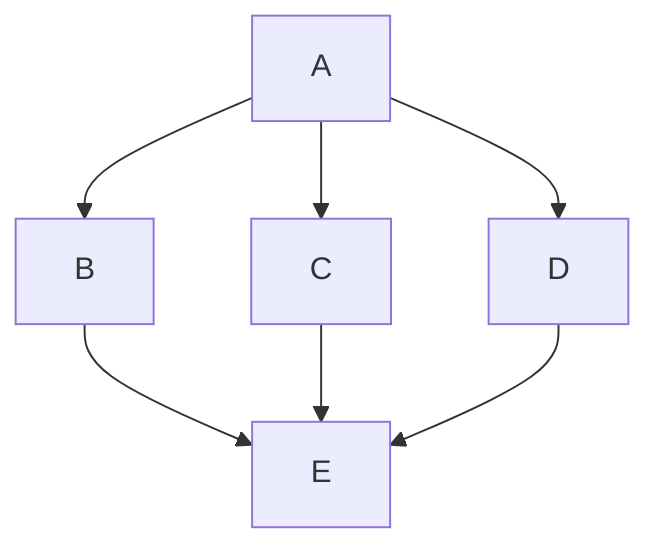
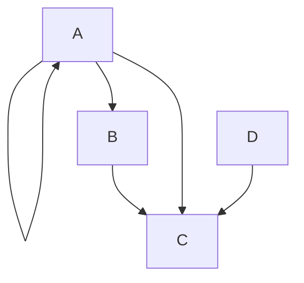
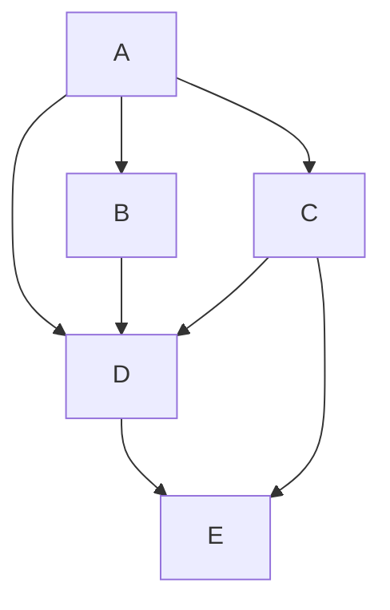
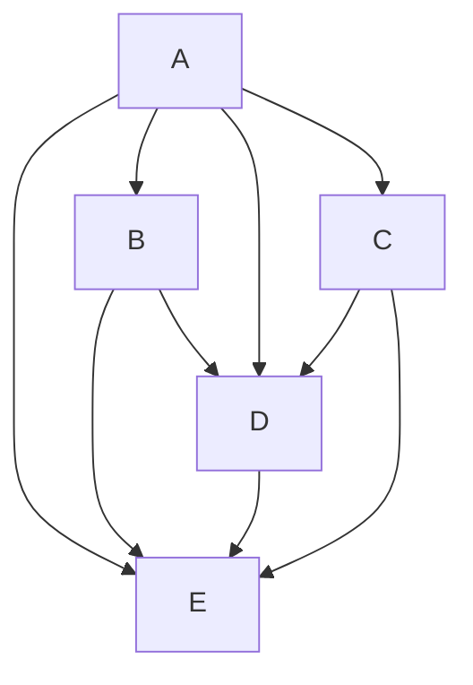
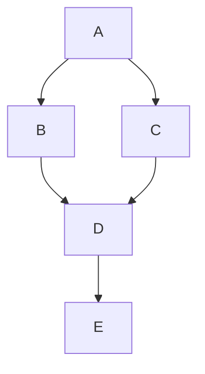
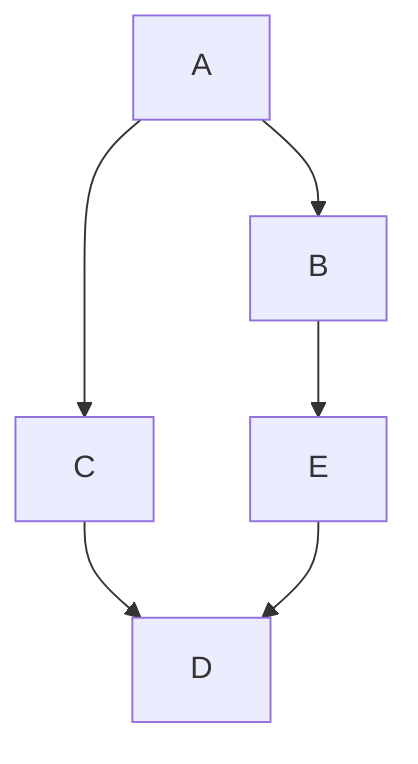
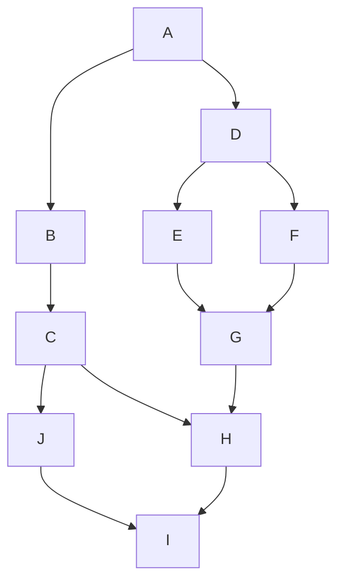
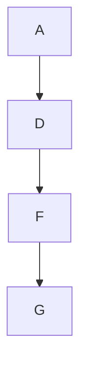
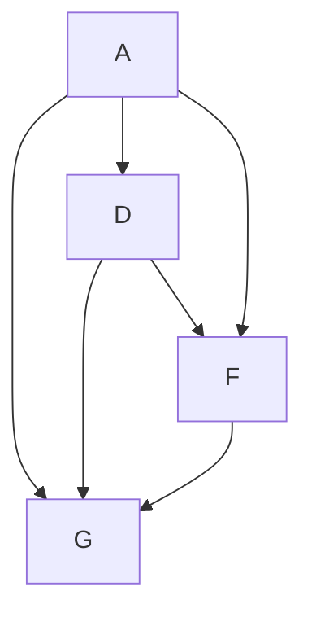
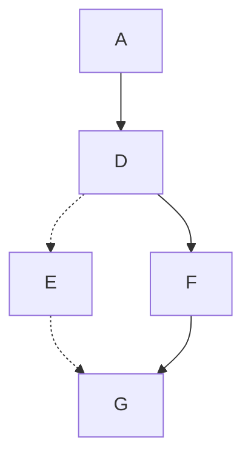

I due tipi di modelli per lo scambio di messaggi nei sistemi concorrenti sono:
1. **Memoria Condivisa (Shared Memory)**: I processi comunicano condividendo variabili in una memoria comune accessibile a tutti.
2. **Passaggio di Messaggi (Message Passing)**: I processi comunicano inviando e ricevendo messaggi attraverso canali di comunicazione definiti.
Si può dimostrare che questi due modelli sono equivalenti ma noi per evidenziare lo scambio di messaggi tra i nodi useremo il secondo metodo.

La differenza principale tra **processi** e **thread** riguarda la condivisione delle risorse e lo spazio di indirizzamento:
- **Processi**: Sono entità indipendenti con il proprio spazio di indirizzamento in memoria. Ogni processo ha le sue risorse allocate dal sistema operativo e comunica con altri processi tramite meccanismi come la memoria condivisa o il passaggio di messaggi.
- **Thread**: Sono flussi di esecuzione all'interno dello stesso processo. Condividono lo spazio di indirizzamento e le risorse del processo padre, il che permette una comunicazione e sincronizzazione più efficienti tra thread.

### Esecuzione Concorrente

#### Definizioni

Definiamo i seguenti elementi per descrivere un modello di esecuzione concorrente:
- **A (Actions)**: Un insieme di azioni, che rappresenta le operazioni o le attività da eseguire in un sistema. Ogni azione può essere considerata un'entità atomica che, all'interno di un contesto concorrente, può essere eseguita indipendentemente o in coordinamento con altre azioni.
- **PC (Precedence Constraints)**: Un insieme di vincoli di precedenza, che definiscono le dipendenze temporali tra le azioni. Alcune azioni devono necessariamente essere completate prima che altre possano iniziare.

Nel contesto di un grafo, rappresentiamo:
- Le **azioni** come nodi. Ogni nodo nel grafo rappresenta una singola azione.
- Le **relazioni di precedenza** come archi diretti tra i nodi. Un arco che collega il nodo di un'azione A a quello di un'azione B (A → B) indica che l'azione A deve essere completata prima che l'azione B possa iniziare.

Il concetto di **relazione** tra due azioni può essere inteso come una funzione che associa elementi del set di azioni a vincoli di precedenza, formando un sottoinsieme del prodotto cartesiano tra l'insieme delle azioni. Questo significa che, dato un insieme di azioni, ogni vincolo (arco) è una coppia ordinata che rappresenta una relazione di dipendenza tra due azioni. 

In pratica, questo modello ci permette di visualizzare e organizzare l'esecuzione concorrente delle azioni, garantendo che i vincoli di precedenza siano rispettati per evitare conflitti o esecuzioni scorrette.



Il grafo risultante viene chiamato DAG (Directly Acyclic Graph) poiché è orientato e senza cicli. Da notare che le operazioni B, C, D possono essere eseguite in parallelo, mentre E deve essere eseguita solo dopo che B, C e D sono state completate. 

#### Rappresentazione Matematica

##### Partial Order
Un **partial order** (o ordine parziale) è una relazione che organizza un insieme di elementi in cui non tutti gli elementi sono necessariamente confrontabili tra loro. In altre parole, ci sono alcuni elementi che possono essere messi in ordine rispetto a una relazione, ma per altri elementi non è possibile dire quale precede l'altro.

Per esempio, immagina di avere un gruppo di compiti da fare. Alcuni compiti devono essere fatti in un certo ordine (ad esempio, devi leggere un documento prima di scriverne un riassunto), mentre altri possono essere fatti in qualsiasi ordine, senza dipendenze. Questo insieme di compiti con vincoli di esecuzione è un esempio di ordine parziale.

Definito matematicamente, un **ordine parziale** su un insieme A è una relazione binaria $\leq_{P} = PC^{+}$.

##### Non-strict partial order
Esistono anche altri ordini come il **non-strict partial order** (o ordine parziale non rigoroso), un tipo di relazione d'ordine in cui alcuni elementi possono essere confrontati con altri, ma non è richiesto che tutti gli elementi siano confrontabili tra loro. Questo tipo di ordine è chiamato "non-strict" perché permette la possibilità che un elemento possa essere in relazione con sé stesso.



Le proprietà di un non-strict partial order sono:
1. **Riflessività**: Ogni elemento è in relazione con sé stesso. Per esempio, un compito è sempre "prima o uguale" a sé stesso, $\forall a\in A, a\leq_{P} a$.
2. **Antisimmetria**: Se un elemento A è in relazione con un elemento B, e B è in relazione con A, allora A e B sono lo stesso elemento, $\forall a, b \in A, (a\leq_{P} b \text{ e } b\leq_{P} a) \Rightarrow a = b$.
3. **Transitività**: Se A è in relazione con B e B è in relazione con C, allora A è in relazione con C, $\forall a, b, c \in A, (a\leq_{P} b \text{ e } b\leq_{P} c) \Rightarrow a \leq_{P} c$.

##### Strict partial order
Uno **strict partial order** (ordine parziale rigoroso) differisce dal non-strict in quanto:
- Non è **riflessivo** ma **irriflessivo**: in un ordine rigoroso, $\not\exists \text{ } a < a$ la relazione  per nessun elemento a. In altre parole, nessun elemento è in relazione con sé stesso.
- La relazione viene spesso indicata con il simbolo $<$ invece di $\leq$, per sottolineare che è rigorosa.

##### POSET (Partially Ordered Set)
Un **POSET** (insieme parzialmente ordinato) è un insieme di elementi dotato di una relazione d'ordine parziale, che segue tre proprietà fondamentali: **riflessività**, **antisimmetria** e **transitività**.

##### Hasse Diagram
Un **Hasse diagram** è una rappresentazione grafica di un POSET. È un modo conveniente per visualizzare un insieme parzialmente ordinato, semplificando la rappresentazione della relazione d'ordine parziale. 
In un Hasse diagram:
- **Nodi** rappresentano gli elementi del POSET.
- **Archi** rappresentano la relazione d'ordine, ma vengono mostrati solo tra gli elementi immediatamente successivi nel POSET. Gli archi transitivi non sono rappresentati direttamente per evitare ridondanze.
- Le relazioni riflessive (come $a \leq_{P} a$) non sono mai rappresentate.
- L'orientamento degli archi è implicito: gli elementi più "alti" nel diagramma sono maggiori rispetto a quelli più "bassi" secondo la relazione d'ordine.

Esempio. 
Elementi di PC:


Elementi di $PC^{+}$, vado ad aggiungere la proprietà transitiva:

Elementi dell'Hasse Diagram, vado a togliere tutte le ridondanze:


#### Concorrenza formalizzata

Formalmente, date due azioni $a\in A$ e $b\in A$ , esse sono **concorrenti** se e solo se non esiste una relazione $a \leq_{P} b$ o $b \leq_{P} a$. 
Questo implica che le azioni non sono soggette a vincoli di precedenza e quindi possono essere eseguite in modo indipendente, la concorrenza viene indicata con $a || b$.

Attenzione a non confondere la concorrenza con la transitività, ecco un esempio per provarlo: 

In questo caso, $b || c$, $c||e$ ma b non è concorrente ad e, cioè non si può fare il passaggio successivo come si fa con la regola transitiva. 

##### Chain

Una **chain** (catena) in un insieme parzialmente ordinato (POSET) è un sottoinsieme in cui tutti gli elementi sono completamente ordinati rispetto alla relazione d'ordine parziale. In altre parole, ogni coppia di elementi nella catena è confrontabile.
In una chain vale l'ordine ordine totale ($\leq_{T}$), cioè un partial order ma con la proprietà aggiuntiva di **totalità**.

Formalmente, dato un POSET P, un sottoinsieme $C\subseteq P$ è una chain se $\forall a,b \in C$, o $a\leq_{P} b$ oppure $b \leq_{P} a$. Questo significa che non ci sono elementi incomparabili all'interno di C, questa proprietà è detta totalità.

Esempio.
Dato il seguente Hasse Diagram:


Una chain rappresentata con l'Hasse diagram è:


Se le volessi rappresentare senza l'Hasse Diagram dovrei inserire anche gli archi dati dalla proprietà transitiva, cioè:

Potenzialmente, anche una singola azione può essere considerata una chain, è di fatto un caso limite.

La **chain più lunga** in un **DAG** corrisponde al **critical path** (cammino critico). Questa chain ci è utile per diversi motivi, tra cui **determinare il tempo di esecuzione minimo**. 
Il cammino critico rappresenta la sequenza di attività che impone la durata minima totale in termini di tempo di esecuzione per completare tutte le operazioni. Qualsiasi ritardo in questa chain ritarderà l'intera esecuzione perché non c'è possibilità di parallelizzare queste operazioni. 

##### Synchronization Actions

Nell'esempio precedente abbiamo identificato la chain A, D, F, G. Tuttavia, prima di eseguire l'azione G, è necessario completare anche l'azione E, che non fa parte della chain.


Questo significa che dobbiamo creare una relazione tra la chain e le azioni esterne ad essa, evidenziando la dipendenza tra E e G. Per rappresentare questo legame, ogni volta che identifichiamo una chain, disegniamo tutti gli archi entranti verso il relativo nodo. Queste dipendenze vengono chiamate **synchronization actions**, e da esse si derivano i **procedure constraints**.

Un caso particolare si presenta quando abbiamo un solo worker (o un solo core). In questo scenario, possiamo semplicemente inserire il nodo E all'interno della chain, prima del nodo G, rispettando così le dipendenze. Questo processo è noto come **ordinamento topologico** (topological sorting) o **linear extension**, e può essere realizzato tramite l'algoritmo di Kahn.

### Algoritmo di Kahn

L'algoritmo di Kahn risolve il problema di ordinare le actions di un sistema concorrente, affinché vengano eseguite in modo sequenziale da un singolo worker (o una sola CPU). L'ordine delle azioni non può essere casuale, ma deve rispettare i vincoli di precedenza. Vediamo come funziona l'algoritmo.

Le azioni vengono suddivise in tre insiemi:
1. **Start Nodes (SN)**: insieme di tutti i nodi senza archi entranti, ovvero quelli da cui è possibile iniziare poiché non dipendono da altre azioni precedenti.
2. **Solution List (S)**: lista ordinata delle actions, che rappresenta la soluzione al problema. Alla fine dell'algoritmo, questa lista conterrà l'ordine con cui il worker eseguirà le operazioni.
3. **Other Nodes (M)**: tutti gli altri nodi che non appartengono agli altri insiemi.

L'obiettivo dell'algoritmo è spostare gradualmente tutti i nodi da SN e M alla lista S, rispettando i vincoli di precedenza.

```c++
while(SN != 0) {
	// preleva un nodo n da SN e aggiungilo 
	// in append alla lista S
	n = SN.getOne();
	S.append(n);
	// per ogni nodo m raggiungibile da n tramite l'arco r
	for(m) {
		// togli l'arco r dal grafo
		graph.remove(r);
		// se m togliendo l'arco r è diventato 
		// uno starting node (cioè non ha archi entranti)
		if(isStartingNode(m)) {
			// sposta m da M a SM perché è diventato uno
			// starting node
			M.remove(m);
			SM.append(m);
		}
	}
}
// quando arrivo qui vuol dire che SN è vuoto
// se il grafo ha ancora archi vuol dire che 
// c'è stato un problema, il grafo non era DAG
if(hasArchs(graph)) {
	throw e; 
}
// altrimenti ritorno la lista con la soluzione
return S;
```

Esempio. 

