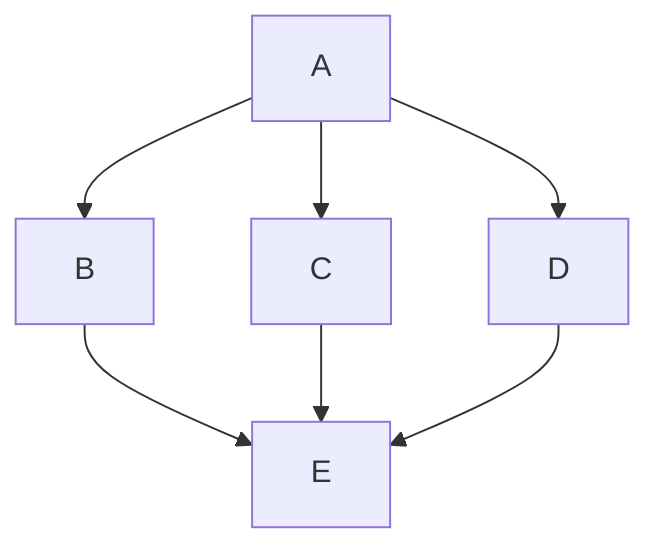
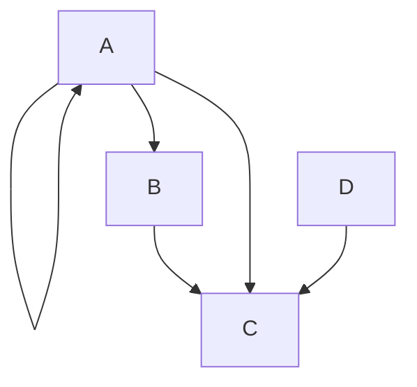

I due tipi di modelli per lo scambio di messaggi nei sistemi concorrenti sono:
1. **Memoria Condivisa (Shared Memory)**: I processi comunicano condividendo variabili in una memoria comune accessibile a tutti.
2. **Passaggio di Messaggi (Message Passing)**: I processi comunicano inviando e ricevendo messaggi attraverso canali di comunicazione definiti.
Si può dimostrare che questi due modelli sono equivalenti ma noi per evidenziare lo scambio di messaggi tra i nodi useremo il secondo metodo.

La differenza principale tra **processi** e **thread** riguarda la condivisione delle risorse e lo spazio di indirizzamento:
- **Processi**: Sono entità indipendenti con il proprio spazio di indirizzamento in memoria. Ogni processo ha le sue risorse allocate dal sistema operativo e comunica con altri processi tramite meccanismi come la memoria condivisa o il passaggio di messaggi.
- **Thread**: Sono flussi di esecuzione all'interno dello stesso processo. Condividono lo spazio di indirizzamento e le risorse del processo padre, il che permette una comunicazione e sincronizzazione più efficienti tra thread.

### Esecuzione Concorrente

#### Definizioni

Definiamo i seguenti elementi per descrivere un modello di esecuzione concorrente:
- **A**: Un insieme di azioni, che rappresenta le operazioni o le attività da eseguire in un sistema. Ogni azione può essere considerata un'entità atomica che, all'interno di un contesto concorrente, può essere eseguita indipendentemente o in coordinamento con altre azioni.
- **PC (Precedence Constraints)**: Un insieme di vincoli di precedenza, che definiscono le dipendenze temporali tra le azioni. Alcune azioni devono necessariamente essere completate prima che altre possano iniziare.

Nel contesto di un grafo, rappresentiamo:
- Le **azioni** come nodi. Ogni nodo nel grafo rappresenta una singola azione.
- Le **relazioni di precedenza** come archi diretti tra i nodi. Un arco che collega il nodo di un'azione A a quello di un'azione B (A → B) indica che l'azione A deve essere completata prima che l'azione B possa iniziare.

Il concetto di **relazione** tra due azioni può essere inteso come una funzione che associa elementi del set di azioni a vincoli di precedenza, formando un sottoinsieme del prodotto cartesiano tra l'insieme delle azioni. Questo significa che, dato un insieme di azioni, ogni vincolo (arco) è una coppia ordinata che rappresenta una relazione di dipendenza tra due azioni. 

In pratica, questo modello ci permette di visualizzare e organizzare l'esecuzione concorrente delle azioni, garantendo che i vincoli di precedenza siano rispettati per evitare conflitti o esecuzioni scorrette.

Il grafo risultante viene chiamato DAG (Directly Acyclic Graph) poiché è orientato e senza cicli. Da notare che le operazioni B, C, D possono essere eseguite in parallelo, mentre E deve essere eseguita solo dopo che B, C e D sono state completate. 

#### Rappresentazione Matematica

##### Partial Order
Un **partial order** (o ordine parziale) è una relazione che organizza un insieme di elementi in cui non tutti gli elementi sono necessariamente confrontabili tra loro. In altre parole, ci sono alcuni elementi che possono essere messi in ordine rispetto a una relazione, ma per altri elementi non è possibile dire quale precede l'altro.

Per esempio, immagina di avere un gruppo di compiti da fare. Alcuni compiti devono essere fatti in un certo ordine (ad esempio, devi leggere un documento prima di scriverne un riassunto), mentre altri possono essere fatti in qualsiasi ordine, senza dipendenze. Questo insieme di compiti con vincoli di esecuzione è un esempio di ordine parziale.

Definito matematicamente, un **ordine parziale** su un insieme A è una relazione binaria $\leq_{P} = PC^{+}$.

##### Non-strict partial order
Esistono anche altri ordini come il **non-strict partial order** (o ordine parziale non rigoroso), un tipo di relazione d'ordine in cui alcuni elementi possono essere confrontati con altri, ma non è richiesto che tutti gli elementi siano confrontabili tra loro. Questo tipo di ordine è chiamato "non-strict" perché permette la possibilità che un elemento possa essere in relazione con sé stesso.

Le proprietà di un non-strict partial order sono:
1. **Riflessività**: Ogni elemento è in relazione con sé stesso. Per esempio, un compito è sempre "prima o uguale" a sé stesso, $\forall a\in A, a\leq_{P} a$.
2. **Antisimmetria**: Se un elemento A è in relazione con un elemento B, e B è in relazione con A, allora A e B sono lo stesso elemento, $\forall a, b \in A, (a\leq_{P} b \text{ e } b\leq_{P} a) \Rightarrow a = b$
3. **Transitività**: Se A è in relazione con B e B è in relazione con C, allora A è in relazione con C, $\forall a, b, c \in A, (a\leq_{P} b \text{ e } b\leq_{P} c) \Rightarrow a \leq_{P} c$

##### Strict partial order
Uno **strict partial order** (ordine parziale rigoroso) differisce dal non-strict in quanto:
- Non è **riflessivo** ma **irriflessivo**: in un ordine rigoroso, $\not\exists \text{ } a < a$ la relazione  per nessun elemento a. In altre parole, nessun elemento è in relazione con sé stesso.
- La relazione viene spesso indicata con il simbolo $<$ invece di $\leq$, per sottolineare che è rigorosa.

##### Poset

