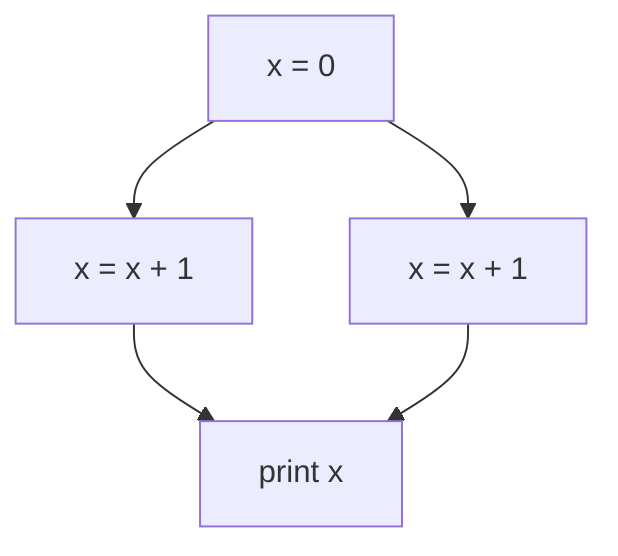

### Principi e concorrenza nella programmazione funzionale

Un paradigma di programmazione è un insieme di principi e strategie che definiscono un *approccio* per risolvere problemi informatici. In pratica, è una modalità di pensiero che guida il modo in cui sviluppiamo e organizziamo il codice per raggiungere un determinato obiettivo. La scelta del paradigma influisce non solo sulla struttura del programma, ma anche sulle sue *performance* e sulla sua *manutenibilità*.

I principali paradigmi si collocano su un ampio spettro, con due estremi significativi:
- **Paradigma imperativo**: il più comune nella programmazione tradizionale, si basa su una sequenza di istruzioni che modificano lo *stato del programma* e controllano il flusso di esecuzione. In questo approccio, il programmatore indica esplicitamente come il calcolo deve essere eseguito, passo dopo passo.

```python
if(x > 0): 
	result = 15/3
else:
	result = 2*3
result = result - 1
```

- **Paradigma funzionale**: in questo modello, non esiste uno stato mutabile; le variabili, una volta assegnate, restano costanti. L'elaborazione avviene tramite la valutazione di espressioni piuttosto che attraverso l'esecuzione di comandi. Questo approccio riduce la possibilità di *effetti collaterali*, rendendo il codice più *prevedibile* e spesso più adatto alla parallelizzazione.

```erlang
(15/3 if x > 0 else 2*3) - 1
(5 if 7 > 0 else 6) - 1
5 - 1
4
```

Altri paradigmi, come quello logico o orientato agli oggetti, si trovano tra questi due estremi, ciascuno con caratteristiche specifiche per affrontare problemi in modo diverso.

Vediamo ora alcuni concetti della programmazione funzionale che non sono comuni in quella imperativa.

#### Espressioni & Referential Transparency

Le computazioni in ambito funzionale consistono nella *valutazione di espressioni*. Un'espressione si definisce **referentially transparent** se può essere sostituita dal suo valore risultante senza alterare il comportamento del programma. In questo caso, l'espressione è priva di effetti collaterali (*side effects*).

Una funzione è detta **pura** quando la sua chiamata è referentially transparent, il che significa che l'esecuzione della funzione non ha effetti collaterali esterni e restituisce sempre lo stesso risultato per gli stessi argomenti.

Quando si verifica la referential transparency, è possibile formalizzare il programma come un **sistema di riscrittura** (rewriting system), composto da oggetti e regole che ne modificano lo stato. Questo approccio risulta particolarmente utile per la **verifica automatica** del codice, per l'**ottimizzazione** e per la **parallelizzazione** delle operazioni, poiché l'assenza di effetti collaterali garantisce un comportamento prevedibile e indipendente dal contesto.

Inoltre, questo concetto abilita l'uso della **memo-ization**: supponiamo di avere una funzione costosa in termini computazionali, ad esempio `f`, e di dover calcolare più volte `f(10)` all'interno del codice. Invece di rieseguire la funzione ogni volta, possiamo memorizzare il risultato in una struttura dati come una hash table, migliorando significativamente le prestazioni. Questo tipo di ottimizzazione è possibile solo in presenza di funzioni pure, ovvero prive di effetti collaterali, rendendolo ideale per sistemi robusti e formalmente verificabili.

#### Lack of State

Nella programmazione funzionale, *non esiste uno stato mutabile*: le variabili, una volta assegnate, non possono essere modificate e agiscono quindi come costanti. Invece di aggiornare i valori esistenti, si creano nuove "variabili" per rappresentare i nuovi dati.

La gestione della memoria in questi contesti è affidata al **garbage collector**, che si occupa di liberare automaticamente la memoria occupata da variabili che non sono più in uso.

#### Eager vs Lazy Evaluation

La valutazione delle espressioni, in particolare per gli argomenti delle funzioni, può essere gestita tramite due principali strategie:
- **Eager evaluation**: esegue il calcolo delle espressioni *il prima possibile*. Questa strategia è comunemente utilizzata nei linguaggi che adottano il passaggio per valore o per riferimento, poiché calcola immediatamente il risultato delle espressioni non appena vengono incontrate.
- **Lazy evaluation**: posticipa la valutazione delle espressioni fino a quando il loro risultato è *strettamente necessario*. Questo approccio, noto anche come **call-by-need**, viene usato per evitare computazioni inutili e può essere più efficiente in determinati contesti, specialmente quando non tutte le espressioni vengono effettivamente utilizzate nel corso dell'esecuzione del programma.

In alcuni casi, la lazy evaluation permette di gestire strutture dati infinite o evitare calcoli pesanti fino a quando non sono richiesti, ottimizzando così le risorse computazionali.

#### First-class & Higher-order Functions

Le funzioni, nei linguaggi che supportano la programmazione funzionale, sono trattate come **first-class citizens**, ovvero possono essere manipolate come qualsiasi altro valore. Ciò significa che possono essere passate come argomenti ad altre funzioni, restituite come risultato da una funzione, o assegnate a variabili.

Le **Higher-order functions** sono quelle che accettano altre funzioni come parametri o che restituiscono funzioni come risultato. Queste funzioni offrono un alto livello di astrazione, permettendo la costruzione di comportamenti complessi in modo modulare e riutilizzabile.

In alcuni casi, le funzioni restituite dipendono dai parametri della funzione che le genera. Per preservare questi valori nel tempo, si utilizzano le **closures**. Una closure è una funzione che "ricorda" l'ambiente in cui è stata creata, mantenendo accesso alle variabili locali anche dopo che la funzione esterna è terminata. Questo consente alle closure di gestire e mantenere lo stato in modo efficace senza ricorrere a variabili globali o mutabili.

#### Uso della Ricorsione

Come è noto, ogni operazione eseguibile con la ricorsione può essere eseguita anche tramite iterazione, e viceversa. Tuttavia, nei linguaggi funzionali, dove *non esistono variabili mutabili* e quindi non si mantiene uno stato, la ricorsione diventa l'unico strumento disponibile per ripetere computazioni.

Uno svantaggio della ricorsione è la gestione della memoria, specialmente nel caso della **tail recursion** (ricorsione di coda). Se una funzione ricorsiva effettua come ultima operazione una nuova chiamata a se stessa, senza particolari ottimizzazioni, questo può causare problemi di performance e portare al superamento dei *limiti dello stack*.

Per mitigare questi problemi, molti linguaggi supportano la **Tail Call Optimization**. In pratica, se l'ultima operazione eseguita da una funzione è una chiamata a un'altra funzione (o a se stessa), il linguaggio può ottimizzare l'esecuzione sostituendo il frame corrente della funzione con quello della successiva, evitando di mantenere entrambi. Questo riduce l'uso dello stack e migliora le prestazioni in scenari ricorsivi.

Alcuni linguaggi, come Python, non implementano questa ottimizzazione, limitando l'efficienza della ricorsione. Al contrario, in linguaggi come C++, è possibile attivare la tail call optimization utilizzando l'opzione di compilazione `-O2` per migliorare le performance e ridurre l'uso della memoria nello stack.

![[Tail Call Optimization.png|center|400]]


#### Uso di strutture dati ricorsive

Nei linguaggi funzionali, dove la ricorsione è l'unico modo per ripetere computazioni, le **strutture dati ricorsive** come le liste diventano particolarmente utili. Una lista può essere vista come composta da due parti: una *"testa"*, che rappresenta il primo elemento, e una *"coda"*, che è il resto della lista. Poiché la coda è anch'essa una lista, questa definizione è intrinsecamente ricorsiva.

Questo approccio ricorsivo alle strutture dati si adatta perfettamente alla logica funzionale, dove non esiste uno stato mutabile. Ad esempio, non possiamo utilizzare strutture come gli array che mantengono uno stato interno mutabile, perché ciò violerebbe il principio di assenza di effetti collaterali. Le liste, invece, permettono di costruire e manipolare dati in modo sicuro e senza mutazione, garantendo che ogni nuova operazione produca una nuova lista senza alterare quella originale.

#### Addressing Concurrency

Il principale problema della concorrenza riguarda i **data races**, fenomeno legato alla mutabilità dei dati. Un data race si verifica quando più thread accedono simultaneamente a una variabile condivisa, con almeno uno di essi che modifica il valore, portando a *comportamenti non deterministici*.

Un esempio di questo è illustrato nel seguente diagramma, dove l'ordine in cui avvengono le operazioni influisce sul risultato finale:



In questo caso, il risultato della stampa `print x` dipende da quale thread esegue prima l'operazione di lettura o scrittura. Se due thread accedono contemporaneamente alla stessa variabile `x`, il valore stampato può variare, creando un comportamento non prevedibile.

Per risolvere questo problema, esistono due principali strategie:
- **Usare variabili immutabili**: in questo modo, non ci sono modifiche simultanee alla stessa variabile, eliminando la possibilità di data races.
- **Utilizzare meccanismi di sincronizzazione**: tecniche come mutex o semafori assicurano che solo un thread alla volta possa accedere alla variabile condivisa, garantendo l'ordine corretto delle operazioni e prevenendo data races. Questo metodo tuttavia limita l'utilizzazione delle risorse.

#### Message Passing

Il **message passing** è un meccanismo che può essere utilizzato anche nella programmazione funzionale, dove i **processi** fungono da componenti di base. In questo contesto, i processi non sono necessariamente unità di esecuzione fisiche, ma *entità astratte* che possono essere mappate su unità computazionali reali, ed eventualmente distribuite su diversi nodi o macchine.

Questo modello è adottato da linguaggi come **Erlang**, che implementa una visione di concorrenza basata su processi che comunicano tra loro attraverso lo scambio di messaggi. Ogni processo è *isolato* e *non condivide memoria* con gli altri, prevenendo i problemi legati alla mutabilità e ai data races. I processi reagiscono alla ricezione dei messaggi, attivando comportamenti specifici in risposta a determinati eventi. 
### Introduzione ad Erlang

#### Visione Generale

Ora che abbiamo compreso i principi generali della programmazione funzionale, possiamo esplorare le principali caratteristiche di **Erlang**.

Il codice Erlang viene eseguito su **ERTS** (Erlang Run-Time System), ma prima deve essere compilato in un linguaggio intermedio. Successivamente, il **bytecode** generato viene eseguito su una **virtual machine** dedicata chiamata **BEAM**. Questo processo di compilazione e interpretazione permette a Erlang di essere portabile ed efficiente su diverse piattaforme.

I file Erlang hanno estensione `.erl` e contengono il **modulo** principale, che definisce le funzioni e la logica del programma.

Un aspetto cruciale è che la **BEAM** si comporta come un singolo processo del sistema operativo (OS), quindi tutta la concorrenza è gestita internamente dalla virtual machine stessa. Erlang utilizza uno o più **scheduler** (uno per ogni core della CPU) per distribuire l'esecuzione dei processi Erlang su tutti i thread del core. Questa gestione permette a Erlang di sfruttare appieno le capacità multicore, distribuendo i processi in modo efficiente senza che il programmatore debba preoccuparsi della gestione di thread o processi OS.

È importante notare che un **processo Erlang** non corrisponde né a un processo del sistema operativo né a un thread. I processi Erlang sono entità leggere e indipendenti gestite dalla virtual machine, consentendo una concorrenza massiva e una gestione ottimizzata delle risorse.

#### Work Stealing

Per migliorare il **load balancing**, è possibile utilizzare una tecnica chiamata **work stealing**.

Il work stealing funziona nel seguente modo: ogni scheduler ha una propria coda di processi da eseguire. Quando uno scheduler esaurisce il lavoro da fare nella sua coda, invece di rimanere inattivo, *'ruba'* processi dalla coda di un altro scheduler che ha ancora processi da eseguire. In questo modo, il carico di lavoro viene bilanciato dinamicamente tra tutti i scheduler disponibili, evitando che alcuni scheduler rimangano sovraccarichi mentre altri sono inattivi.

#### OTP (Open Telecom Platform)

**OTP** (Open Telecom Platform) è un set completo di strumenti, componenti, librerie e pattern progettati per semplificare e migliorare lo sviluppo di applicazioni in **Erlang**. Funziona come un middleware, fornendo strutture e meccanismi standard per gestire aspetti cruciali dello sviluppo software, come la concorrenza, la tolleranza ai guasti, il bilanciamento del carico e la distribuzione dei processi.

È stato chiamato "Open Telecom Platform" perché originariamente sviluppato per essere utilizzato in applicazioni di *telecomunicazioni*, come sistemi di controllo per router, dove affidabilità e prestazioni erano critiche.

#### Espressioni, Variabili, Pattern Match, Atoms

In **Erlang**, le *espressioni* vengono valutate sequenzialmente, una dopo l'altra. La forma più semplice di espressione è il **term**, ovvero un dato di qualsiasi tipo (numeri, stringhe, liste, ecc.), che viene valutato per restituire se stesso.

Le espressioni possono essere composte da *sotto-espressioni*, combinate tramite *operatori*. Anche le variabili sono considerate espressioni: ogni variabile è associata a un valore e la sua valutazione restituisce quel valore.

In Erlang, le **variabili** seguono una convenzione specifica: devono iniziare con una *lettera maiuscola* oppure con un underscore (`_`). Il linguaggio è **dinamicamente tipato**, il che significa che quando una variabile viene creata, non ha un tipo predefinito. Tuttavia, non appena le viene assegnato un valore, la variabile assume il tipo di quell'oggetto e non può più cambiare né tipo né valore.

Il **pattern matching** in Erlang è un meccanismo che consente di *confrontare* una struttura dati con uno *schema* (pattern) e, se c'è una corrispondenza, di associare automaticamente le variabili ai valori all'interno di quella struttura. Viene utilizzato per destrutturare dati complessi, come tuple o liste, senza bisogno di istruzioni condizionali esplicite. Questo processo non è solo un confronto, ma anche un'assegnazione: le variabili nel pattern vengono legate ai valori corrispondenti se la struttura coincide.

Un **atom** in Erlang rappresenta un valore costante e unico all'interno del programma, simile agli enumerati di altri linguaggi di programmazione. Il valore di un atom è l'atom stesso, cioè non ha un valore associato oltre al suo nome. Gli atom iniziano con una lettera **minuscola** (non maiuscola) e, se contengono caratteri speciali o spazi, possono essere racchiusi tra **singoli apici** (`' '`).

#### Tuple

La **tupla** in Erlang è un tipo di dato composto con un numero fisso di elementi, detti **terms**. Viene utilizzata per raggruppare dati diversi in un'unica struttura, simile alle strutture in C, ma senza nomi di campo. Le tuple sono delimitate da **parentesi graffe** e i loro elementi sono separati da **virgole**.

Un esempio di una tupla potrebbe essere `{Name, Age, City}`. I valori contenuti in una tupla possono essere facilmente estratti usando il **pattern matching**. Ecco un esempio:

```erlang
Person = {john, 30, london},
{Name, Age, City} = Person.
Age.
30
```

#### Liste

Una **lista** in Erlang è un tipo di dato composto utilizzato per memorizzare un numero arbitrario di elementi, detti **terms**. Le liste sono delimitate da **parentesi quadre** e gli elementi sono separati da **virgole**. A differenza delle tuple, le liste sono ricorsive per natura, composte da una **testa** (il primo elemento) e una **coda**, che è a sua volta un'altra lista. Questo le rende adatte per l'elaborazione tramite *ricorsione*.

In Erlang, è possibile utilizzare le **List Comprehensions**, una notazione compatta per generare e filtrare elementi in una lista in base a regole specifiche, simile alla sintassi di Python. Ecco un semplice esempio:

```erlang
Squares = [X * X || X <- [1, 2, 3, 4, 5]].
```

In questo caso, la list comprehension genera una nuova lista contenente i quadrati dei numeri da 1 a 5. Il risultato sarà la seguente lista: `[1, 4, 9, 16, 25]`.

Il pattern `X * X || X <- [1, 2, 3, 4, 5]` significa "per ogni `X` nella lista `[1, 2, 3, 4, 5]`, calcola `X * X` e inserisci il risultato nella nuova lista".

#### Stringhe

In Erlang, le stringhe non hanno un tipo di dato speciale, ma sono rappresentate come liste di interi. È possibile definire una stringa utilizzando le doppie virgolette (`""`).

#### Moduli

Un modulo in Erlang ha generalmente lo stesso nome del file che lo contiene. Esso è composto da metadati, che includono informazioni come il nome del modulo e le funzioni esportate, seguiti dalla definizione delle funzioni vere e proprie.

La sintassi di un modulo può essere esemplificata con il classico "Hello World":
```erlang
-module(hello).
-export([world/0]).

world() ->
    io:format("Hello, world!~n").
```

I moduli possono essere compilati direttamente nella CLI di Erlang usando il comando `c(nome_modulo).`. Una volta compilato, un modulo può essere importato in altri moduli tramite la clausola `-import(hello, [world/0])`.

#### Funzioni

La struttura di una funzione in Erlang è:

```erlang
function_name(Pattern1, Pattern2, ..., PatternN) when [guard] -> Body.
```

Il nome della funzione è un `atom`, mentre i parametri sono dei pattern. L'arity, ossia il numero di parametri della funzione, deve essere specificata quando si esporta la funzione. 
Nel body si possono inserire espressioni che verranno valutate in sequenza, separate da virgole.

Un guard è un'espressione che restituisce un valore booleano. Se presente, il guard viene valutato prima di eseguire il corpo della funzione. Alcuni guard comuni includono `is_number(X)`, che verifica se `X` è un numero.

#### Case expression

Se dobbiamo eseguire pattern matching con molte clausole, è conveniente utilizzare l'espressione `case`. La sintassi è:

```erlang
case Expression of
    P1 [when C1] -> E1;
    P2 [when C2] -> E2;
    ...
    Pn [when Cn] -> En;
end
```

Il funzionamento è il seguente:
1. Viene valutata l'espressione e si cerca un match nell'ordine in cui appaiono i pattern.
2. Se si verifica un match, viene controllato se il guard associato passa.
3. Se il guard è vero, viene eseguita l'espressione corrispondente e viene ritornato il valore.

È sempre consigliabile inserire una clausola di default per evitare che venga sollevata un'eccezione in caso nessun match sia valido.
#### IF expression

Un'altra espressione condizionale in Erlang è l'`if`, con la seguente sintassi:

```erlang
if
    Guard1 -> E1;
    Guard2 -> E2;
    ...
    Guardn -> En;
end
```

Per evitare il sollevamento di eccezioni, si aggiunge spesso una clausola `true` finale. Tuttavia, il professore sconsiglia l'uso degli `if`, suggerendo di utilizzare il `case`.
#### Loop

Come già detto, nei linguaggi funzionali non esiste uno stato, quindi l'unico modo per eseguire dei loop è tramite la ricorsione. Ecco un esempio di loop in Erlang che stampa "hello world" 5 volte:

```erlang
-module(helloworld).
-export([loop/1]).

loop(0) -> ok;
loop(N) ->
    io:format("Hello, world!~n"),
    loop(N - 1).
```

In questo esempio, la funzione `loop/1` continua a chiamare sé stessa riducendo il valore di `N` fino a raggiungere 0, momento in cui il loop termina.

#### Fun (Lambda)

In Erlang, le `fun` sono l'equivalente delle *lambda function* in Python: funzioni anonime che possono essere definite e utilizzate senza avere un nome. Le `fun` sono molto utili quando si vuole definire una funzione temporanea o passare una funzione come argomento.

La sintassi base per creare una `fun` è:

```erlang
FunName = fun(Param1, Param2, ..., ParamN) -> Body end.
```

Ad esempio, una `fun` che somma due numeri può essere scritta così:

```erlang
Sum = fun(X, Y) -> X + Y end.
Result = Sum(3, 5). % Risultato: 8
```

Le `fun` possono anche avere un numero variabile di pattern o condizioni, come nelle funzioni normali. Ad esempio:

```erlang
Max = fun(X, Y) when X > Y -> X;
              (_, Y) -> Y
        end.
Result = Max(4, 10). % Risultato: 10
```

##### Esempio 

![[Esempio Lambda.png|center|700]]

Definiamo un modulo chiamato `mycontrols` con due funzioni esportate: `myfor/3` e `test/0`. 

La funzione `myfor/3` è una ricorsione che simula un loop `for`, iterando da un valore iniziale `I` fino a un valore massimo `Max`, applicando un'operazione data a ciascun valore.
La sintassi di `myfor/3` è la seguente:

```erlang
myfor(Max, Max, Oper) -> [Oper(Max)];
myfor(I, Max, Oper) -> [Oper(I) | myfor(I+1, Max, Oper)].
```

- **Caso base**: quando `I` è uguale a `Max`, la funzione applica l'operazione `Oper` su `Max` e restituisce una lista con il risultato: `[Oper(Max)]`.
  
- **Caso ricorsivo**: quando `I` è diverso da `Max`, la funzione applica l'operazione `Oper` su `I` e poi richiama sé stessa incrementando `I` (`I+1`) fino a raggiungere `Max`. Il risultato viene costruito concatenando (con `|`) l'elemento corrente con il resto della lista.

La funzione `test/0` chiama `myfor/3` per eseguire un ciclo che va da 1 a 5, applicando una funzione anonima che moltiplica ciascun numero per 2.

```erlang
test() -> myfor(1, 5, fun(X) -> 2*X end).
```

- Qui viene passato `fun(X) -> 2*X end` come operazione da applicare. Questa `fun` moltiplica ogni valore per 2.
- La funzione restituisce una lista di risultati: `[2, 4, 6, 8, 10]`.

Il secondo esempio sulla destra effettua un'altra chiamata a `myfor/3` è mostrata per un intervallo da 1 a 3, con una funzione anonima che esegue il calcolo `(Z * Z) / 2`, cioè il quadrato di `Z` diviso per 2:

```erlang
myfor(1, 3, fun(Z) -> Z*Z/2 end).
```

- La funzione anonima qui eleva `Z` al quadrato e divide il risultato per 2.
- I valori elaborati sono 1, 2, 3, e la funzione restituisce la lista: `[0.5, 2.0, 4.5]`.
### Il modello Actor

Un modello possibile per un sistema concorrente è quello degli **attori** (Actor). 
In questo modello, l'unità fondamentale è l'attore, e una computazione può essere eseguita da *uno o più attori*. 
Un aspetto cruciale è che ogni attore non condivide lo stato con altri attori, anche quando eseguono lo stesso compito. La comunicazione tra attori avviene tramite il passaggio di messaggi asincroni, specificando l'ActorID e il messaggio da inviare. 
Gli attori vengono creati da altri attori, e il loro avanzamento dipende dalla ricezione di nuovi messaggi.

Il **comportamento** di un attore si definisce in base a come reagisce alla ricezione di un messaggio. Le azioni possibili sono:
1. Inviare un numero finito di messaggi ad altri attori.
2. Creare un numero finito di nuovi attori.
3. Definire il comportamento da adottare per gestire i messaggi successivi.

#### Concorrenza in Erlang

In Erlang, un attore è chiamato processo, ma non ha alcuna relazione con il concetto tradizionale di processo. Questo termine è stato scelto per motivi storici. In Erlang, esistono tre principali costrutti concorrenti:
1. **Creazione di un processo (o attore)**: tramite `spawn(module_name, function, [params])`, che restituisce il PID del processo appena creato.
2. **Invio di un messaggio**: il simbolo `!`, chiamato "bang", viene utilizzato in questo modo: `PID ! message` e ritorna il messaggio stesso.
3. **Ricezione di un messaggio**: il costrutto `receive ... end`, la cui sintassi è simile a uno switch case.

Come detto, in Erlang la comunicazione avviene tramite *segnali asincroni* (i più comuni sono i messaggi). Un messaggio è costituito da un destinatario e un contenuto, che può essere qualsiasi termine di Erlang, anche se il più utilizzato è la tupla. 
L'ordine di ricezione dei messaggi segue una logica **FIFO** per tutti i segnali. 
Oltre ai messaggi, esistono altri tipi di segnali, come Exit, Link/Unlink, Monitor/Demonitor, che verranno approfonditi successivamente.

Ogni processo ha una propria *mailbox* (una coda) per conservare i messaggi ricevuti. La mailbox può essere ispezionata tramite la funzione `process_info(PID, messages)`. Per estrarre un messaggio dalla mailbox, si utilizza il costrutto `receive`, che è *bloccante* fino a quando non arriva un nuovo messaggio.

##### Esempio: Ping Pong

In questo esempio, vengono definiti due processi concorrenti, `alice` e `bob`, che comunicano tra loro tramite messaggi.
La funzione `alice` agisce in questo modo: 

```erlang
% caso base: quando N = 0, ho finito
alice(0, Other_PID) ->
	% invia l'atom finished
    Other_PID ! finished,
    io:format("Alice finished~n");

% caso ricorsivo: quando N > 0
alice(N, Other_PID) ->
	% invia una tupla con il proprio PID in modo che Bob
	% possa rispondere al messaggio
    Other_PID ! {ping_msg, self()},
    receive
	    % riceve il messaggio pong
        pong_msg ->
            io:format("Alice received pong~n")
    end,
    % richiama se stessa con N decrementato di 1
    alice(N - 1, Other_PID).
```

Invece `bob` funziona nel seguente modo:

```erlang
bob() ->
    receive
	    % ricezione dell'atom finished
        finished -> 
            io:format("Bob finished~n");

		% ricezione della tupla
        {ping_msg, Other_PID} ->
            io:format("Bob received ping~n"),
            % usa il PID della tupla per inviare pong
            Other_PID ! pong_msg,
            % richiama se stesso ricorsivamente
            bob()
    end.
```

Infine, abbiamo la funzione `start` che prima, crea un nuovo processo che esegue la funzione `bob` usando `spawn(?MODULE, bob, [])`, e salva il PID del processo Bob in `Bob_PID`. Poi, crea un processo che esegue la funzione `alice` con un valore iniziale di 2 e passa il PID di Bob come parametro.

```erlang
start() ->
	% crea il processo Bob
    Bob_PID = spawn(?MODULE, bob, []),
    % crea il processo Alice e passa il PID di Bob
    spawn(?MODULE, alice, [2, Bob_PID]).

```


##### Applicazione Client-Server

In Erlang è possibile implementare un'applicazione che segue il paradigma Client-Server utilizzando la comunicazione tramite messaggi asincroni. 
Il processo server si comporta nel seguente modo: 
- **Aspetta una richiesta dal client**.
- **Calcola la risposta**.
- **Invia la risposta al client**.
Un esempio di codice è:

```erlang
-module(server).
-export([start/0, loop/0]).

start() -> 
	spawn(?MODULE, loop, []).

loop() -> 
	receive
		{From, {plus, X, Y}} ->
			From ! {self(), X+Y},
			loop();
		{From, {minus, X, Y}} ->
			From ! {self(), X-Y},
			loop();
		% nel caso in cui il server venga killato
		stop ->
			ok;
		% nel caso in cui si riceve un messaggio sconosciuto
		_Unexpected -> 
			loop();
	end.
```

Il processo client invece si comporta come segue:
- **Invia una richiesta al server**.
- **Aspetta e riceve la risposta**.
Un esempio di codice è:

```erlang
-module(client).
-export([start/4, body/4]).

start(ServerID, OperationID, X, Y) ->
	spawn(?MODULE, body, [ServerID, OperationID, X, Y]).
	
body(ServerID, OperationID, X, Y) ->
	ServerID ! {self(), {OperationID, X, Y}},
	receive
		{ServerID, Result} ->
			io:format("Result: ~p~n", [Result])
	end.
```

Il codice del client può essere astratto tramite l'uso di funcitons:

```erlang
-module(client).
-export([start/4, body/4]).

start(ServerID, OperationID, X, Y) ->
	spawn(?MODULE, body, [ServerID, OperationID, X, Y]).

request(ServerID, Msg) ->
	ServerID ! {self(), Msg},
	receive
		{ServerID, Result} -> Result
	end.
body(ServerID, OperationID, X, Y) ->
	Result = request(ServerID, {OperationID, X, Y}),
	io:format("Result: ~p~n", [Result]).
```

Se il server viene killato mentre il client è in attesa di una risposta, il client rimarrebbe bloccato all'infinito, aspettando un messaggio che non arriverà mai. Per evitare questo problema, possiamo usare la clausola `after` all'interno del blocco `receive`. Questa clausola consente di specificare un timeout: se la risposta non arriva entro un certo periodo di tempo, il client smette di aspettare e può gestire l'errore o eseguire altre operazioni.

```erlang
-module(client).
-export([start/4, body/4]).

start(ServerID, OperationID, X, Y) ->
	spawn(?MODULE, body, [ServerID, OperationID, X, Y]).
	
body(ServerID, OperationID, X, Y) ->
	ServerID ! {self(), {OperationID, X, Y}},
	receive
		{ServerID, Result} ->
			io:format("Result: ~p~n", [Result])
	after 5000 -> % (5 secondi)
		io:format("Timeout: nessuna risposta dal server entro il tempo limite.~n")
	end.
```

Un timeout pari a zero può essere molto utile, ad esempio, per svuotare tutti i messaggi presenti nella mailbox di un processo, senza bloccare il programma in attesa di nuovi messaggi. In questo caso, il client esamina immediatamente la mailbox e, se non ci sono messaggi, procede senza attendere.

D'altra parte, il valore `infinity` come timeout significa che il processo aspetterà indefinitamente finché non riceve un messaggio, senza mai scadere.

##### Publish dei processi

Molto spesso, invece di riferirsi ai processi tramite il loro PID, è più conveniente utilizzare un nome simbolico (un atom), soprattutto quando si desidera un meccanismo semplice e leggibile per l'identificazione dei processi. In Erlang, è possibile associare un nome a un processo registrandolo in un *repository* accessibile globalmente da tutti i processi. 

Le funzioni principali per gestire i nomi dei processi sono:
- `register(atom, PID)`: Registra il processo identificato dal PID con un determinato nome (un atom).
- `unregister(atom)`: Rimuove la registrazione di un processo associato a un nome (atomo).
- `whereis(atom)`: Restituisce il PID del processo registrato con un determinato nome (se esiste).
- `registered() -> [atom]`: Restituisce una lista di tutti i nomi registrati attualmente.

##### Mantenere lo stato del server

Nei linguaggi funzionali come Erlang, *non esiste lo stato mutabile*, ma è possibile mantenere una sorta di "stato" utilizzando la ricorsione e passando i parametri da una chiamata all'altra. Questo approccio viene spesso utilizzato nei server per gestire dati persistenti tra le chiamate, come un contatore di richieste.

```erlang
-module(staticserver).
-export([start/0, loop/1]).

start() ->
	spawn(?MODULE, loop, [0]).
loop(N) ->
	io:format("Loop number: ~p~n", [N]),
	receive
	...
		loop(N+1);
	end.
	
```

### Going concurrent & distributed actually