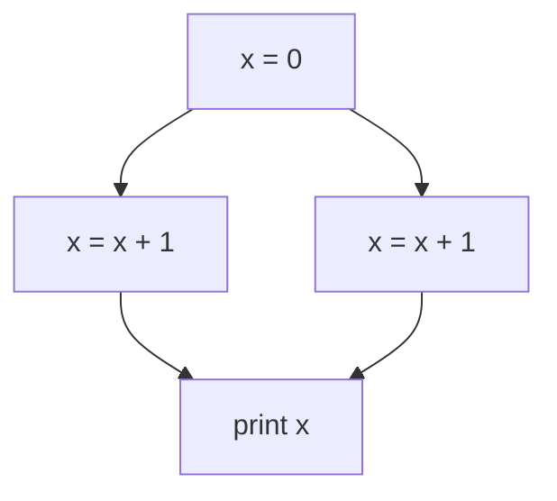

### Principi e concorrenza nella programmazione funzionale

Un paradigma di programmazione è un insieme di principi e strategie che definiscono un *approccio* per risolvere problemi informatici. In pratica, è una modalità di pensiero che guida il modo in cui sviluppiamo e organizziamo il codice per raggiungere un determinato obiettivo. La scelta del paradigma influisce non solo sulla struttura del programma, ma anche sulle sue *performance* e sulla sua *manutenibilità*.

I principali paradigmi si collocano su un ampio spettro, con due estremi significativi:
- **Paradigma imperativo**: il più comune nella programmazione tradizionale, si basa su una sequenza di istruzioni che modificano lo *stato del programma* e controllano il flusso di esecuzione. In questo approccio, il programmatore indica esplicitamente come il calcolo deve essere eseguito, passo dopo passo.

```python
if(x > 0): 
	result = 15/3
else:
	result = 2*3
result = result - 1
```

- **Paradigma funzionale**: in questo modello, non esiste uno stato mutabile; le variabili, una volta assegnate, restano costanti. L'elaborazione avviene tramite la valutazione di espressioni piuttosto che attraverso l'esecuzione di comandi. Questo approccio riduce la possibilità di *effetti collaterali*, rendendo il codice più *prevedibile* e spesso più adatto alla parallelizzazione.

```erlang
(15/3 if x > 0 else 2*3) - 1
(5 if 7 > 0 else 6) - 1
5 - 1
4
```

Altri paradigmi, come quello logico o orientato agli oggetti, si trovano tra questi due estremi, ciascuno con caratteristiche specifiche per affrontare problemi in modo diverso.

Vediamo ora alcuni concetti della programmazione funzionale che non sono comuni in quella imperativa.

#### Espressioni & Referential Transparency

Le computazioni in ambito funzionale consistono nella *valutazione di espressioni*. Un'espressione si definisce **referentially transparent** se può essere sostituita dal suo valore risultante senza alterare il comportamento del programma. In questo caso, l'espressione è priva di effetti collaterali (*side effects*).

Una funzione è detta **pura** quando la sua chiamata è referentially transparent, il che significa che l'esecuzione della funzione non ha effetti collaterali esterni e restituisce sempre lo stesso risultato per gli stessi argomenti.

Quando si verifica la referential transparency, è possibile formalizzare il programma come un **sistema di riscrittura** (rewriting system), composto da oggetti e regole che ne modificano lo stato. Questo approccio risulta particolarmente utile per la **verifica automatica** del codice, per l'**ottimizzazione** e per la **parallelizzazione** delle operazioni, poiché l'assenza di effetti collaterali garantisce un comportamento prevedibile e indipendente dal contesto.

Inoltre, questo concetto abilita l'uso della **memo-ization**: supponiamo di avere una funzione costosa in termini computazionali, ad esempio `f`, e di dover calcolare più volte `f(10)` all'interno del codice. Invece di rieseguire la funzione ogni volta, possiamo memorizzare il risultato in una struttura dati come una hash table, migliorando significativamente le prestazioni. Questo tipo di ottimizzazione è possibile solo in presenza di funzioni pure, ovvero prive di effetti collaterali, rendendolo ideale per sistemi robusti e formalmente verificabili.

#### Lack of State

Nella programmazione funzionale, *non esiste uno stato mutabile*: le variabili, una volta assegnate, non possono essere modificate e agiscono quindi come costanti. Invece di aggiornare i valori esistenti, si creano nuove "variabili" per rappresentare i nuovi dati.

La gestione della memoria in questi contesti è affidata al **garbage collector**, che si occupa di liberare automaticamente la memoria occupata da variabili che non sono più in uso.

#### Eager vs Lazy Evaluation

La valutazione delle espressioni, in particolare per gli argomenti delle funzioni, può essere gestita tramite due principali strategie:
- **Eager evaluation**: esegue il calcolo delle espressioni *il prima possibile*. Questa strategia è comunemente utilizzata nei linguaggi che adottano il passaggio per valore o per riferimento, poiché calcola immediatamente il risultato delle espressioni non appena vengono incontrate.
- **Lazy evaluation**: posticipa la valutazione delle espressioni fino a quando il loro risultato è *strettamente necessario*. Questo approccio, noto anche come **call-by-need**, viene usato per evitare computazioni inutili e può essere più efficiente in determinati contesti, specialmente quando non tutte le espressioni vengono effettivamente utilizzate nel corso dell'esecuzione del programma.

In alcuni casi, la lazy evaluation permette di gestire strutture dati infinite o evitare calcoli pesanti fino a quando non sono richiesti, ottimizzando così le risorse computazionali.

#### First-class & Higher-order Functions

Le funzioni, nei linguaggi che supportano la programmazione funzionale, sono trattate come **first-class citizens**, ovvero possono essere manipolate come qualsiasi altro valore. Ciò significa che possono essere passate come argomenti ad altre funzioni, restituite come risultato da una funzione, o assegnate a variabili.

Le **Higher-order functions** sono quelle che accettano altre funzioni come parametri o che restituiscono funzioni come risultato. Queste funzioni offrono un alto livello di astrazione, permettendo la costruzione di comportamenti complessi in modo modulare e riutilizzabile.

In alcuni casi, le funzioni restituite dipendono dai parametri della funzione che le genera. Per preservare questi valori nel tempo, si utilizzano le **closures**. Una closure è una funzione che "ricorda" l'ambiente in cui è stata creata, mantenendo accesso alle variabili locali anche dopo che la funzione esterna è terminata. Questo consente alle closure di gestire e mantenere lo stato in modo efficace senza ricorrere a variabili globali o mutabili.

#### Uso della Ricorsione

Come è noto, ogni operazione eseguibile con la ricorsione può essere eseguita anche tramite iterazione, e viceversa. Tuttavia, nei linguaggi funzionali, dove *non esistono variabili mutabili* e quindi non si mantiene uno stato, la ricorsione diventa l'unico strumento disponibile per ripetere computazioni.

Uno svantaggio della ricorsione è la gestione della memoria, specialmente nel caso della **tail recursion** (ricorsione di coda). Se una funzione ricorsiva effettua come ultima operazione una nuova chiamata a se stessa, senza particolari ottimizzazioni, questo può causare problemi di performance e portare al superamento dei *limiti dello stack*.

Per mitigare questi problemi, molti linguaggi supportano la **Tail Call Optimization**. In pratica, se l'ultima operazione eseguita da una funzione è una chiamata a un'altra funzione (o a se stessa), il linguaggio può ottimizzare l'esecuzione sostituendo il frame corrente della funzione con quello della successiva, evitando di mantenere entrambi. Questo riduce l'uso dello stack e migliora le prestazioni in scenari ricorsivi.

Alcuni linguaggi, come Python, non implementano questa ottimizzazione, limitando l'efficienza della ricorsione. Al contrario, in linguaggi come C++, è possibile attivare la tail call optimization utilizzando l'opzione di compilazione `-O2` per migliorare le performance e ridurre l'uso della memoria nello stack.

![[Tail Call Optimization.png|center|400]]


#### Uso di strutture dati ricorsive

Nei linguaggi funzionali, dove la ricorsione è l'unico modo per ripetere computazioni, le **strutture dati ricorsive** come le liste diventano particolarmente utili. Una lista può essere vista come composta da due parti: una *"testa"*, che rappresenta il primo elemento, e una *"coda"*, che è il resto della lista. Poiché la coda è anch'essa una lista, questa definizione è intrinsecamente ricorsiva.

Questo approccio ricorsivo alle strutture dati si adatta perfettamente alla logica funzionale, dove non esiste uno stato mutabile. Ad esempio, non possiamo utilizzare strutture come gli array che mantengono uno stato interno mutabile, perché ciò violerebbe il principio di assenza di effetti collaterali. Le liste, invece, permettono di costruire e manipolare dati in modo sicuro e senza mutazione, garantendo che ogni nuova operazione produca una nuova lista senza alterare quella originale.

#### Addressing Concurrency

Il principale problema della concorrenza riguarda i **data races**, fenomeno legato alla mutabilità dei dati. Un data race si verifica quando più thread accedono simultaneamente a una variabile condivisa, con almeno uno di essi che modifica il valore, portando a *comportamenti non deterministici*.

Un esempio di questo è illustrato nel seguente diagramma, dove l'ordine in cui avvengono le operazioni influisce sul risultato finale:



In questo caso, il risultato della stampa `print x` dipende da quale thread esegue prima l'operazione di lettura o scrittura. Se due thread accedono contemporaneamente alla stessa variabile `x`, il valore stampato può variare, creando un comportamento non prevedibile.

Per risolvere questo problema, esistono due principali strategie:
- **Usare variabili immutabili**: in questo modo, non ci sono modifiche simultanee alla stessa variabile, eliminando la possibilità di data races.
- **Utilizzare meccanismi di sincronizzazione**: tecniche come mutex o semafori assicurano che solo un thread alla volta possa accedere alla variabile condivisa, garantendo l'ordine corretto delle operazioni e prevenendo data races. Questo metodo tuttavia limita l'utilizzazione delle risorse.

#### Message Passing

Il **message passing** è un meccanismo che può essere utilizzato anche nella programmazione funzionale, dove i **processi** fungono da componenti di base. In questo contesto, i processi non sono necessariamente unità di esecuzione fisiche, ma *entità astratte* che possono essere mappate su unità computazionali reali, ed eventualmente distribuite su diversi nodi o macchine.

Questo modello è adottato da linguaggi come **Erlang**, che implementa una visione di concorrenza basata su processi che comunicano tra loro attraverso lo scambio di messaggi. Ogni processo è *isolato* e *non condivide memoria* con gli altri, prevenendo i problemi legati alla mutabilità e ai data races. I processi reagiscono alla ricezione dei messaggi, attivando comportamenti specifici in risposta a determinati eventi. 
### Introduzione ad Erlang

#### Visione Generale

Ora che abbiamo compreso i principi generali della programmazione funzionale, possiamo esplorare le principali caratteristiche di **Erlang**.

Il codice Erlang viene eseguito su **ERTS** (Erlang Run-Time System), ma prima deve essere compilato in un linguaggio intermedio. Successivamente, il **bytecode** generato viene eseguito su una **virtual machine** dedicata chiamata **BEAM**. Questo processo di compilazione e interpretazione permette a Erlang di essere portabile ed efficiente su diverse piattaforme.

I file Erlang hanno estensione `.erl` e contengono il **modulo** principale, che definisce le funzioni e la logica del programma.

Un aspetto cruciale è che la **BEAM** si comporta come un singolo processo del sistema operativo (OS), quindi tutta la concorrenza è gestita internamente dalla virtual machine stessa. Erlang utilizza uno o più **scheduler** (uno per ogni core della CPU) per distribuire l'esecuzione dei processi Erlang su tutti i thread del core. Questa gestione permette a Erlang di sfruttare appieno le capacità multicore, distribuendo i processi in modo efficiente senza che il programmatore debba preoccuparsi della gestione di thread o processi OS.

È importante notare che un **processo Erlang** non corrisponde né a un processo del sistema operativo né a un thread. I processi Erlang sono entità leggere e indipendenti gestite dalla virtual machine, consentendo una concorrenza massiva e una gestione ottimizzata delle risorse.

#### Work Stealing

Per migliorare il **load balancing**, è possibile utilizzare una tecnica chiamata **work stealing**.

Il work stealing funziona nel seguente modo: ogni scheduler ha una propria coda di processi da eseguire. Quando uno scheduler esaurisce il lavoro da fare nella sua coda, invece di rimanere inattivo, *'ruba'* processi dalla coda di un altro scheduler che ha ancora processi da eseguire. In questo modo, il carico di lavoro viene bilanciato dinamicamente tra tutti i scheduler disponibili, evitando che alcuni scheduler rimangano sovraccarichi mentre altri sono inattivi.

#### OTP (Open Telecom Platform)

**OTP** (Open Telecom Platform) è un set completo di strumenti, componenti, librerie e pattern progettati per semplificare e migliorare lo sviluppo di applicazioni in **Erlang**. Funziona come un middleware, fornendo strutture e meccanismi standard per gestire aspetti cruciali dello sviluppo software, come la concorrenza, la tolleranza ai guasti, il bilanciamento del carico e la distribuzione dei processi.

È stato chiamato "Open Telecom Platform" perché originariamente sviluppato per essere utilizzato in applicazioni di *telecomunicazioni*, come sistemi di controllo per router, dove affidabilità e prestazioni erano critiche.

#### Espressioni, Variabili, Pattern Match, Atoms

In **Erlang**, le *espressioni* vengono valutate sequenzialmente, una dopo l'altra. La forma più semplice di espressione è il **term**, ovvero un dato di qualsiasi tipo (numeri, stringhe, liste, ecc.), che viene valutato per restituire se stesso.

Le espressioni possono essere composte da *sotto-espressioni*, combinate tramite *operatori*. Anche le variabili sono considerate espressioni: ogni variabile è associata a un valore e la sua valutazione restituisce quel valore.

In Erlang, le **variabili** seguono una convenzione specifica: devono iniziare con una *lettera maiuscola* oppure con un underscore (`_`). Il linguaggio è **dinamicamente tipato**, il che significa che quando una variabile viene creata, non ha un tipo predefinito. Tuttavia, non appena le viene assegnato un valore, la variabile assume il tipo di quell'oggetto e non può più cambiare né tipo né valore.

Il **pattern matching** in Erlang è un meccanismo che consente di *confrontare* una struttura dati con uno *schema* (pattern) e, se c'è una corrispondenza, di associare automaticamente le variabili ai valori all'interno di quella struttura. Viene utilizzato per destrutturare dati complessi, come tuple o liste, senza bisogno di istruzioni condizionali esplicite. Questo processo non è solo un confronto, ma anche un'assegnazione: le variabili nel pattern vengono legate ai valori corrispondenti se la struttura coincide.

Un **atom** in Erlang rappresenta un valore costante e unico all'interno del programma, simile agli enumerati di altri linguaggi di programmazione. Il valore di un atom è l'atom stesso, cioè non ha un valore associato oltre al suo nome. Gli atom iniziano con una lettera **minuscola** (non maiuscola) e, se contengono caratteri speciali o spazi, possono essere racchiusi tra **singoli apici** (`' '`).

#### Tuple

La **tupla** in Erlang è un tipo di dato composto con un numero fisso di elementi, detti **terms**. Viene utilizzata per raggruppare dati diversi in un'unica struttura, simile alle strutture in C, ma senza nomi di campo. Le tuple sono delimitate da **parentesi graffe** e i loro elementi sono separati da **virgole**.

Un esempio di una tupla potrebbe essere `{Name, Age, City}`. I valori contenuti in una tupla possono essere facilmente estratti usando il **pattern matching**. Ecco un esempio:

```erlang
Person = {john, 30, london},
{Name, Age, City} = Person.
Age.
30
```

#### Liste

Una **lista** in Erlang è un tipo di dato composto utilizzato per memorizzare un numero arbitrario di elementi, detti **terms**. Le liste sono delimitate da **parentesi quadre** e gli elementi sono separati da **virgole**. A differenza delle tuple, le liste sono ricorsive per natura, composte da una **testa** (il primo elemento) e una **coda**, che è a sua volta un'altra lista. Questo le rende adatte per l'elaborazione tramite *ricorsione*.

In Erlang, è possibile utilizzare le **List Comprehensions**, una notazione compatta per generare e filtrare elementi in una lista in base a regole specifiche, simile alla sintassi di Python. Ecco un semplice esempio:

```erlang
Squares = [X * X || X <- [1, 2, 3, 4, 5]].
```

In questo caso, la list comprehension genera una nuova lista contenente i quadrati dei numeri da 1 a 5. Il risultato sarà la seguente lista: `[1, 4, 9, 16, 25]`.

Il pattern `X * X || X <- [1, 2, 3, 4, 5]` significa "per ogni `X` nella lista `[1, 2, 3, 4, 5]`, calcola `X * X` e inserisci il risultato nella nuova lista".

#### Stringhe

In Erlang, le stringhe non hanno un tipo di dato speciale, ma sono rappresentate come liste di interi. È possibile definire una stringa utilizzando le doppie virgolette (`""`).

#### Moduli

Un modulo in Erlang ha generalmente lo stesso nome del file che lo contiene. Esso è composto da metadati, che includono informazioni come il nome del modulo e le funzioni esportate, seguiti dalla definizione delle funzioni vere e proprie.

La sintassi di un modulo può essere esemplificata con il classico "Hello World":
```erlang
-module(hello).
-export([world/0]).

world() ->
    io:format("Hello, world!~n").
```

I moduli possono essere compilati direttamente nella CLI di Erlang usando il comando `c(nome_modulo).`. Una volta compilato, un modulo può essere importato in altri moduli tramite la clausola `-import(hello, [world/0])`.

#### Funzioni


### Il modello Actor

### Going concurrent & distributed actually